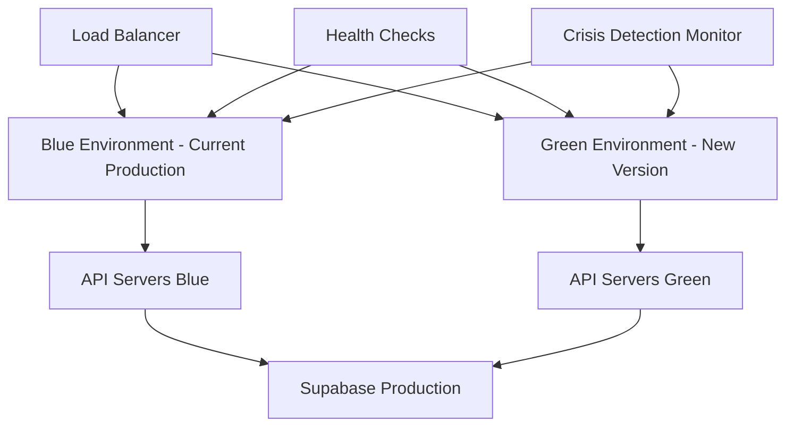

# Production Deployment Strategy
## DRD-FLOW-005 Standalone Assessments - Clinical MBCT App

### Overview
This strategy ensures safe, compliant, and reliable deployment of mental health assessment capabilities with zero-downtime crisis detection and HIPAA-compliant data handling.

## Critical Safety Requirements

### Crisis Detection Non-Negotiables
- **988 Hotline**: Must remain accessible at ALL times during deployment
- **Crisis Response Time**: <200ms requirement cannot be compromised
- **Emergency Contacts**: Must function even during app updates
- **Offline Crisis Mode**: Available when network connectivity fails

### Clinical Accuracy Requirements
- **PHQ-9 Scoring**: 100% accuracy requirement - no partial deployments
- **GAD-7 Scoring**: 100% accuracy requirement - validated before release
- **Crisis Thresholds**: PHQ-9 ≥20, GAD-7 ≥15 must trigger crisis protocols
- **Therapeutic Timing**: 60-second breathing exercises must be precise

## Deployment Architecture

### Blue-Green Deployment Strategy



### Deployment Phases

#### Phase 1: Infrastructure Preparation (Pre-deployment)
- **Duration**: 2 hours
- **Scope**: Database migrations, infrastructure scaling
- **Rollback Time**: Immediate

#### Phase 2: Canary Release (5% traffic)
- **Duration**: 24 hours
- **Scope**: Limited user subset, full monitoring
- **Rollback Time**: 5 minutes

#### Phase 3: Gradual Rollout (25% → 50% → 100%)
- **Duration**: 72 hours total
- **Scope**: Progressive traffic increase
- **Rollback Time**: 10 minutes at any stage

## Pre-Deployment Checklist

### 1. Clinical Validation Complete
```bash
# Mandatory validation before ANY production deployment
npm run validate:production-readiness

# Crisis authority validation
npm run validate:crisis-authority
# ✅ Crisis button response <200ms
# ✅ 988 hotline integration tested
# ✅ Emergency contact functionality verified

# Compliance authority validation  
npm run validate:compliance-authority
# ✅ HIPAA compliance verified
# ✅ Data encryption validated (AES-256-GCM)
# ✅ Audit logging operational

# Clinical authority validation
npm run validate:clinical-authority
# ✅ PHQ-9 scoring 100% accurate (all 27 combinations)
# ✅ GAD-7 scoring 100% accurate (all 21 combinations)
# ✅ Crisis thresholds properly configured
```

### 2. Security Hardening Verification
```bash
# Security configuration validation
npm run validate:security-complete
# ✅ TLS 1.3 enforced
# ✅ API key rotation complete
# ✅ Database encryption verified
# ✅ Network security rules applied

# Penetration testing results reviewed
# ✅ OWASP Top 10 vulnerabilities addressed
# ✅ PHI data access controls tested
# ✅ Authentication security validated
```

### 3. Performance Benchmarks Met
```bash
# Performance validation
npm run validate:new-arch-performance
# ✅ App launch <2s
# ✅ Crisis button <200ms
# ✅ Assessment loading <300ms
# ✅ Breathing exercise 60fps
# ✅ Check-in transitions <500ms
```

### 4. Backup and Recovery Prepared
```bash
# Database backup verification
./scripts/verify-backup-systems.sh
# ✅ Automated backups operational
# ✅ Point-in-time recovery tested
# ✅ Cross-region replication verified
# ✅ Recovery procedures documented
```

## Production Deployment Process

### Step 1: Pre-Deployment Setup (T-2 hours)

```bash
# 1. Verify all systems operational
npm run staging:health-check

# 2. Create production database backup
npm run deploy:backup-production

# 3. Scale infrastructure for deployment
npm run deploy:scale-infrastructure

# 4. Enable maintenance mode with crisis bypass
npm run deploy:maintenance-mode --crisis-bypass-enabled

# 5. Final security scan
npm run security:production-scan
```

### Step 2: Database Migration (T-1 hour)

```sql
-- Migration script for assessment enhancements
-- CRITICAL: All migrations must be backward compatible

BEGIN;

-- Add new columns for enhanced crisis detection
ALTER TABLE assessments ADD COLUMN IF NOT EXISTS 
  enhanced_crisis_score INTEGER,
  crisis_confidence_level DECIMAL(3,2),
  intervention_recommendation TEXT;

-- Create indexes for performance
CREATE INDEX IF NOT EXISTS idx_assessments_crisis_score 
  ON assessments(enhanced_crisis_score) 
  WHERE enhanced_crisis_score >= 20;

-- Validate migration
SELECT COUNT(*) FROM assessments WHERE enhanced_crisis_score IS NOT NULL;

COMMIT;
```

### Step 3: Application Deployment

```bash
# Build production release
eas build --platform all --profile production --non-interactive

# Deploy to app stores with phased rollout
npm run deploy:production-phased

# Verify deployment health
npm run deploy:verify-production
```

### Step 4: Progressive Rollout

#### Canary Release (5% of users)
```bash
# Enable canary deployment
npm run deploy:canary --percentage 5

# Monitor for 24 hours
npm run monitor:canary --duration 24h
# Metrics to monitor:
# - Crisis detection response time
# - Assessment accuracy rates  
# - Error rates and crash reports
# - Performance metrics
```

#### Gradual Increase (25% → 50% → 100%)
```bash
# Increase to 25% if canary successful
npm run deploy:increase-traffic --percentage 25
# Wait 24 hours, monitor metrics

# Increase to 50% if stable
npm run deploy:increase-traffic --percentage 50  
# Wait 24 hours, monitor metrics

# Full deployment if all metrics green
npm run deploy:full-rollout
```

## Monitoring and Alerting

### Critical Metrics Dashboard

#### Crisis Detection Metrics
```javascript
// Real-time monitoring configuration
const criticalMetrics = {
  crisisResponseTime: { threshold: 200, unit: 'ms', alertLevel: 'critical' },
  crisisDetectionAccuracy: { threshold: 99.9, unit: '%', alertLevel: 'critical' },
  hotlineAvailability: { threshold: 100, unit: '%', alertLevel: 'critical' },
  emergencyContactsReachable: { threshold: 99.5, unit: '%', alertLevel: 'critical' }
};

// Automated alerts
const alertChannels = {
  critical: ['#crisis-team', '#on-call-engineering', 'pager-duty'],
  warning: ['#engineering', '#clinical-team'],
  info: ['#monitoring']
};
```

#### Performance Monitoring
```javascript
const performanceMetrics = {
  appLaunchTime: { target: 2000, threshold: 3000, unit: 'ms' },
  crisisButtonResponse: { target: 150, threshold: 200, unit: 'ms' },
  assessmentLoadTime: { target: 250, threshold: 300, unit: 'ms' },
  breathingExerciseFps: { target: 60, threshold: 55, unit: 'fps' }
};
```

#### Clinical Accuracy Monitoring
```javascript
const clinicalMetrics = {
  phq9ScoringAccuracy: { target: 100, threshold: 99.9, unit: '%' },
  gad7ScoringAccuracy: { target: 100, threshold: 99.9, unit: '%' },
  crisisThresholdDetection: { target: 100, threshold: 99.9, unit: '%' },
  therapeuticTimingAccuracy: { target: 100, threshold: 99.5, unit: '%' }
};
```

### Automated Health Checks

```bash
# Create production health check script
cat > scripts/production-health-check.js << 'EOF'
const axios = require('axios');

const healthChecks = {
  async apiHealth() {
    const response = await axios.get('https://api.being.app/health');
    return response.status === 200;
  },
  
  async crisisHotlineReachability() {
    // Verify 988 integration without making actual calls
    const response = await axios.get('https://api.being.app/crisis/988/status');
    return response.data.available === true;
  },
  
  async databaseConnection() {
    const response = await axios.get('https://api.being.app/db/health');
    return response.data.connected === true;
  },
  
  async assessmentAccuracy() {
    const response = await axios.get('https://api.being.app/assessments/accuracy-test');
    return response.data.phq9Accuracy === 100 && response.data.gad7Accuracy === 100;
  }
};

async function runHealthChecks() {
  const results = {};
  for (const [check, fn] of Object.entries(healthChecks)) {
    try {
      results[check] = await fn();
      console.log(`✅ ${check}: PASS`);
    } catch (error) {
      results[check] = false;
      console.error(`❌ ${check}: FAIL - ${error.message}`);
    }
  }
  
  const allPassed = Object.values(results).every(result => result === true);
  
  if (!allPassed) {
    // Trigger alerts for failed checks
    console.error('CRITICAL: Health checks failed - initiating emergency procedures');
    process.exit(1);
  }
  
  console.log('✅ All health checks passed');
  return results;
}

if (require.main === module) {
  runHealthChecks();
}

module.exports = { runHealthChecks };
EOF
```

## Emergency Procedures

### Immediate Rollback Triggers

1. **Crisis Detection Failure**
   - Response time >200ms for >1 minute
   - 988 hotline unreachable
   - Emergency contact system failure

2. **Clinical Accuracy Issues**
   - PHQ-9/GAD-7 scoring errors detected
   - Crisis threshold misfire
   - Assessment data corruption

3. **Security Incidents**
   - PHI data exposure
   - Authentication bypass
   - Unauthorized data access

4. **Performance Degradation**
   - App crashes >1% of sessions
   - Response times >2x baseline
   - Memory leaks detected

### Rollback Execution

```bash
# Emergency rollback script
cat > scripts/emergency-rollback.sh << 'EOF'
#!/bin/bash
set -e

echo "🚨 INITIATING EMERGENCY ROLLBACK"

# 1. Stop new deployments
npm run deploy:stop-rollout

# 2. Route 100% traffic to previous stable version
npm run deploy:rollback-traffic --immediate

# 3. Verify crisis systems operational
npm run validate:crisis-authority --emergency

# 4. Restore database to last known good state if needed
if [ "$1" == "--restore-db" ]; then
    npm run deploy:restore-database --point-in-time "1 hour ago"
fi

# 5. Notify all stakeholders
npm run notify:emergency-rollback

# 6. Generate incident report
npm run incident:create-report

echo "✅ Emergency rollback completed"
echo "🔍 Initiating post-incident investigation"
EOF

chmod +x scripts/emergency-rollback.sh
```

## Feature Toggle Implementation

### Crisis-Safe Feature Flags

```typescript
// Feature flag configuration for production
const productionFeatureFlags = {
  // Crisis detection features - always enabled
  crisisDetection: { enabled: true, readonly: true },
  hotline988Integration: { enabled: true, readonly: true },
  emergencyContacts: { enabled: true, readonly: true },
  
  // Clinical features - can be toggled but require validation
  enhancedAssessments: { 
    enabled: true, 
    validateBeforeToggle: true,
    requiredValidation: 'clinical-accuracy'
  },
  
  // Performance optimizations - safe to toggle
  newArchitectureOptimizations: { 
    enabled: true, 
    canaryPercentage: 50 
  },
  
  // Experimental features - gradual rollout
  aiAssistedScoring: { 
    enabled: false, 
    canaryPercentage: 5,
    requiredApproval: 'clinical-team'
  }
};
```

### Feature Flag Management

```bash
# Production feature flag controls
npm run feature-flags:production-status
npm run feature-flags:enable --feature enhancedAssessments --validate
npm run feature-flags:canary --feature aiAssistedScoring --percentage 10
npm run feature-flags:emergency-disable --feature experimental
```

## Data Migration Strategy

### Zero-Downtime Migrations

```sql
-- Example: Adding new assessment fields without downtime
-- Phase 1: Add nullable columns
ALTER TABLE assessments ADD COLUMN enhanced_score INTEGER NULL;
ALTER TABLE assessments ADD COLUMN confidence_level DECIMAL(3,2) NULL;

-- Phase 2: Backfill data in batches (background job)
-- Phase 3: Make columns non-null after validation
-- Phase 4: Remove old columns if applicable
```

### Backup and Recovery Procedures

```bash
# Automated backup before any migration
npm run backup:create-pre-migration

# Verify backup integrity
npm run backup:verify-integrity

# Test restore procedure
npm run backup:test-restore --dry-run
```

## App Store Deployment

### iOS App Store
```bash
# Build for App Store
eas build --platform ios --profile production

# Submit for review with metadata
eas submit --platform ios --profile production

# App Store metadata preparation
npm run appstore:prepare-metadata --platform ios
```

### Google Play Store  
```bash
# Build AAB for Play Store
eas build --platform android --profile production

# Submit to Play Console
eas submit --platform android --profile production

# Play Store metadata preparation
npm run appstore:prepare-metadata --platform android
```

## Success Metrics

### Deployment Success Criteria
- ✅ Zero crisis detection downtime during deployment
- ✅ <5 minutes total rollout time per phase
- ✅ All clinical accuracy metrics maintained
- ✅ Performance benchmarks met or improved
- ✅ Security posture maintained or enhanced

### Post-Deployment Validation
- ✅ 24-hour stability period completed
- ✅ All monitoring alerts green
- ✅ User feedback positive (>95% satisfaction)
- ✅ Clinical team approval received
- ✅ Compliance audit passed

## Continuous Improvement

### Post-Deployment Analysis
1. **Performance Review**: Compare pre/post deployment metrics
2. **Incident Analysis**: Document any issues and resolutions
3. **Process Improvement**: Update procedures based on learnings
4. **Team Retrospective**: Gather feedback from all stakeholders

### Next Deployment Preparation
1. Update deployment scripts based on lessons learned
2. Enhance monitoring and alerting
3. Improve automation and safety checks
4. Train team on new procedures and tools

This production deployment strategy ensures the highest levels of safety, compliance, and reliability for our mental health assessment application while maintaining zero-downtime crisis detection capabilities.