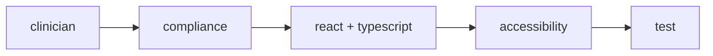
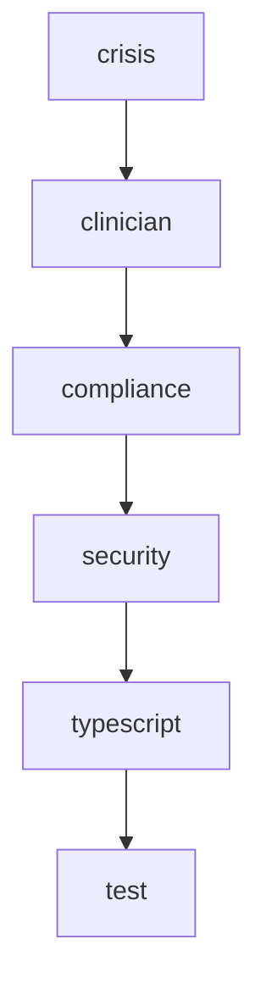
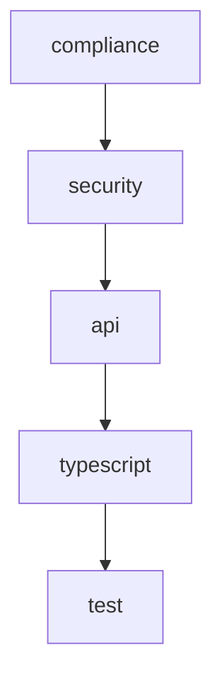

# FullMind Agent Usage Guide

## Project Overview

FullMind is a React Native MBCT (Mindfulness-Based Cognitive Therapy) mental health app featuring:
- **Three Daily Check-ins**: Morning (6 screens), Midday (3 screens), Evening (4 screens)
- **Clinical Assessments**: PHQ-9 (depression), GAD-7 (anxiety) with crisis intervention
- **Offline-First Architecture**: Full functionality without internet, sync when available
- **Therapeutic Focus**: Evidence-based MBCT practices adapted for daily micro-sessions
- **Privacy-First**: HIPAA-conscious design with user data control

## FullMind Codebase Structure

```
active/fullmind/
├── app/
│   └── src/
│       ├── components/          # Reusable UI components
│       │   ├── checkin/        # Check-in specific components
│       │   ├── core/           # Core UI components (Button, Card, etc.)
│       │   ├── dialogs/        # Modal dialogs and confirmations
│       │   ├── modals/         # Full-screen modals
│       │   └── network/        # Network status components
│       ├── constants/          # App constants and configuration
│       ├── flows/              # Multi-screen user flows
│       │   ├── assessment/     # PHQ-9/GAD-7 assessment flows
│       │   └── evening/        # Evening reflection screens
│       ├── hooks/              # Custom React hooks
│       ├── navigation/         # React Navigation configuration
│       ├── screens/            # Individual screen components
│       ├── services/           # Business logic and data services
│       │   └── storage/        # Data persistence layer
│       ├── store/              # Zustand state management
│       ├── types/              # TypeScript type definitions
│       └── utils/              # Utility functions and validation
└── .claude/
    ├── CLAUDE.md           # Project configuration
    └── agents/             # Project-specific agents
        └── project/        # FullMind-specific agents
```

## Key FullMind Files & Patterns

### **State Management** (Zustand Stores)
- `/src/store/checkInStore.ts` - Check-in data and partial session management
- `/src/store/assessmentStore.ts` - Clinical assessment scoring and crisis detection
- `/src/store/userStore.ts` - User preferences and profile management

### **Core Services**
- `/src/services/storage/DataStore.ts` - AsyncStorage data persistence
- `/src/services/NetworkService.ts` - Network status and offline handling
- `/src/services/OfflineQueueService.ts` - Offline data synchronization
- `/src/services/ExportService.ts` - Data export (PDF/CSV) functionality

### **Check-in Components**
- `/src/components/checkin/BodyAreaGrid.tsx` - Interactive body awareness grid
- `/src/components/checkin/EmotionGrid.tsx` - Emotion selection interface
- `/src/flows/MorningCheckInFlow.tsx` - Morning check-in orchestration

### **Assessment System**
- `/src/flows/assessment/AssessmentFlow.tsx` - PHQ-9/GAD-7 flow management
- `/src/flows/assessment/AssessmentQuestionScreen.tsx` - Individual assessment questions
- `/src/screens/assessment/AssessmentResultsScreen.tsx` - Results and crisis routing

### **Type Definitions**
- `/src/types.ts` - Complete type definitions for CheckIn, Assessment, User data

## Common FullMind Development Workflows

### 1. Check-in Flow Enhancement

**Scenario**: Add new question to morning check-in flow

**Agent Workflow**:
```bash
# 1. Therapeutic Validation
Task(subagent_type: "clinician", 
     prompt: "Review this new mindfulness question for morning check-in: 'What is your intention for mindful living today?' Ensure it aligns with MBCT principles and fits the 6-screen morning flow.",
     description: "Validate new morning question")

# 2. Implementation Planning  
Task(subagent_type: "react",
     prompt: "Add new intention question to MorningCheckInFlow.tsx after the energy levels screen. Consider navigation flow, state management, and component reusability.",
     description: "Implement new check-in question")

# 3. Type Safety
Task(subagent_type: "typescript",
     prompt: "Update CheckInData interface in types.ts to include 'dailyIntention' field with proper typing and validation.",
     description: "Update types for new field")

# 4. State Integration
Task(subagent_type: "state", 
     prompt: "Update checkInStore.ts to handle the new dailyIntention field with proper validation, sanitization, and persistence.",
     description: "Integrate new field with state")
```

### 2. Crisis Detection Enhancement

**Scenario**: Improve PHQ-9 crisis detection accuracy

**Agent Workflow**:
```bash
# 1. Crisis Protocol Analysis
Task(subagent_type: "crisis",
     prompt: "Review current PHQ-9 crisis detection in assessmentStore.ts. We trigger at score ≥15 or item 9 >1. Analyze false positive rates and recommend threshold adjustments.",
     description: "Analyze crisis detection accuracy")

# 2. Clinical Validation
Task(subagent_type: "clinician", 
     prompt: "Based on crisis agent recommendations, validate proposed changes maintain therapeutic appropriateness and don't miss at-risk users.",
     description: "Validate clinical appropriateness")

# 3. Compliance Check
Task(subagent_type: "compliance",
     prompt: "Ensure proposed crisis detection changes meet HIPAA requirements and don't create additional reporting obligations.",
     description: "Validate regulatory compliance")

# 4. Implementation
Task(subagent_type: "typescript",
     prompt: "Implement enhanced crisis detection logic with proper typing, validation, and error handling in assessmentStore.ts",
     description: "Implement detection improvements")
```

### 3. Performance Optimization

**Scenario**: Morning check-in flow is slow on older Android devices

**Agent Workflow**:
```bash
# 1. Performance Analysis
Task(subagent_type: "performance",
     prompt: "Analyze performance bottlenecks in MorningCheckInFlow.tsx and related components (BodyAreaGrid, EmotionGrid). Focus on render optimization and memory usage on Android.",
     description: "Identify performance bottlenecks")

# 2. React Native Optimization
Task(subagent_type: "react",
     prompt: "Based on performance analysis, optimize BodyAreaGrid and EmotionGrid components for 60fps performance. Consider FlatList optimization, gesture handling, and platform differences.",
     description: "Implement RN optimizations")

# 3. State Optimization
Task(subagent_type: "state",
     prompt: "Optimize checkInStore subscription patterns and state updates to minimize re-renders during check-in flow navigation.",
     description: "Optimize state management")
```

### 4. Accessibility Enhancement

**Scenario**: Make check-in flows accessible for screen readers

**Agent Workflow**:
```bash
# 1. Accessibility Audit
Task(subagent_type: "accessibility",
     prompt: "Audit MorningCheckInFlow, BodyAreaGrid, and EmotionGrid for WCAG AA compliance. Focus on screen reader accessibility for therapeutic content.",
     description: "Comprehensive accessibility audit")

# 2. Therapeutic Accessibility
Task(subagent_type: "clinician",
     prompt: "Ensure accessibility improvements maintain therapeutic effectiveness of body awareness and emotion identification exercises.",
     description: "Validate therapeutic accessibility")

# 3. React Native Implementation
Task(subagent_type: "react", 
     prompt: "Implement VoiceOver/TalkBack support for BodyAreaGrid and EmotionGrid components with proper accessibility labels and hints.",
     description: "Implement accessibility features")
```

### 5. Data Export Enhancement

**Scenario**: Add new export format with clinical summary

**Agent Workflow**:
```bash
# 1. Architecture Review
Task(subagent_type: "architect",
     prompt: "Design architecture for clinical summary export feature. Consider data aggregation, PDF generation, privacy, and integration with ExportService.ts.",
     description: "Design export architecture")

# 2. Compliance Validation
Task(subagent_type: "compliance", 
     prompt: "Ensure clinical summary export meets HIPAA requirements, user consent, and data portability rights.",
     description: "Validate export compliance")

# 3. API Design
Task(subagent_type: "api",
     prompt: "Design data aggregation API for clinical summaries including check-in trends, assessment history, and therapeutic progress metrics.",
     description: "Design summary API")

# 4. Implementation
Task(subagent_type: "typescript",
     prompt: "Implement clinical summary types and data processing logic with proper validation and error handling.",
     description: "Implement summary logic")
```

## FullMind Agent Integration Patterns

### Pattern 1: Therapeutic Feature Development



**Usage**: Any feature that involves therapeutic content or user interaction
**Sequence**:
1. **clinician** validates therapeutic appropriateness
2. **compliance** ensures regulatory compliance  
3. **react + typescript** implement with proper types
4. **accessibility** ensures inclusive design
5. **test** validates functionality

### Pattern 2: Crisis System Enhancement



**Usage**: Changes to crisis detection, intervention, or safety protocols
**Critical Path**: crisis → clinician → compliance (must validate safety first)

### Pattern 3: Performance & Scalability


**Usage**: Optimization work for better user experience
**Focus**: Technical optimization while maintaining therapeutic effectiveness

### Pattern 4: Data & Privacy



**Usage**: Data handling, export, privacy, or security enhancements
**Critical**: compliance and security validation before implementation

## FullMind-Specific Agent Examples

### Project Agent Examples

#### Clinician Agent
```bash
# Validate new meditation exercise
Task(subagent_type: "clinician",
     prompt: "Review this 3-minute breathing exercise for midday reset flow. Ensure it follows MBCT mindfulness principles and is appropriate for anxiety management.",
     description: "Validate breathing exercise")

# Review therapeutic language
Task(subagent_type: "clinician", 
     prompt: "Review all user-facing text in EmotionGrid.tsx for therapeutic appropriateness. Ensure non-judgmental, empowering language that supports emotional awareness.",
     description: "Review therapeutic language")
```

#### Crisis Agent  
```bash
# Validate crisis thresholds
Task(subagent_type: "crisis",
     prompt: "Review PHQ-9 item 9 (suicidal ideation) scoring in assessmentStore.ts. Should we trigger crisis intervention for 'nearly every day' (3) or only 'more than half the days' (2)?",
     description: "Validate crisis thresholds")

# Design safety resources
Task(subagent_type: "crisis",
     prompt: "Design crisis resource screen with 988 Suicide Lifeline, Crisis Text Line, and local emergency services. Ensure immediate access without navigation complexity.",
     description: "Design crisis resources")
```

#### Compliance Agent
```bash
# Validate data export
Task(subagent_type: "compliance",
     prompt: "Review ExportService.ts PDF export functionality for HIPAA compliance. Ensure user authentication, secure generation, and proper data handling.",
     description: "Validate export compliance")

# Privacy policy review
Task(subagent_type: "compliance",
     prompt: "Review data collection in checkInStore.ts against privacy policy. Ensure we only collect necessary therapeutic data and provide proper user control.",
     description: "Review privacy compliance")
```

### Technical Agent Examples

#### React Agent (FullMind Context)
```bash
# Optimize check-in navigation
Task(subagent_type: "react",
     prompt: "Optimize navigation between 6 morning check-in screens. Users report delays on screen transitions. Focus on React Navigation performance and gesture handling.",
     description: "Optimize check-in navigation")

# Platform-specific therapeutic features
Task(subagent_type: "react", 
     prompt: "Implement haptic feedback for BodyAreaGrid selections on iOS/Android. Ensure therapeutic appropriateness and battery efficiency.",
     description: "Add therapeutic haptics")
```

#### State Agent (FullMind Context)
```bash
# Optimize offline sync
Task(subagent_type: "state",
     prompt: "Optimize checkInStore offline sync patterns. Users lose partial sessions when network reconnects. Improve conflict resolution and data consistency.",
     description: "Improve offline sync")

# Partial session recovery
Task(subagent_type: "state",
     prompt: "Enhance partial session management in checkInStore. Allow users to resume interrupted check-ins up to 24 hours later with proper state validation.",
     description: "Enhance session recovery")
```

## Quick Reference: When to Use Which Agent

### **Therapeutic Content** → clinician
- Check-in questions and flows
- Mindfulness exercises
- User-facing therapeutic language
- MBCT principle validation

### **Safety & Crisis** → crisis  
- Assessment scoring thresholds
- Crisis intervention protocols
- Emergency resource design
- Risk assessment logic

### **Privacy & Compliance** → compliance
- Data export functionality
- User consent flows  
- HIPAA compliance validation
- Privacy policy alignment

### **React Native Issues** → react
- Performance optimization
- Platform-specific features
- Navigation and user experience
- Component architecture

### **Complex Types** → typescript
- Store typing patterns
- API response interfaces
- Complex generic patterns
- Type safety improvements

### **Slow Performance** → performance
- Bundle size analysis
- Runtime optimization
- Memory usage analysis
- Animation performance

### **State Management** → state
- Zustand store patterns
- Async state handling
- Offline sync strategies
- Complex state flows

### **Security Issues** → security
- Data encryption
- Authentication patterns
- Vulnerability assessment
- Secure storage

### **Testing Strategy** → test
- Test architecture
- Coverage analysis
- Mocking strategies
- CI/CD integration

### **Code Quality** → review
- Code review and refactoring
- Technical debt analysis
- Best practice enforcement
- Architecture assessment

### **API Integration** → api
- Data service design
- Error handling patterns
- Caching strategies
- Network resilience

### **Deployment Issues** → deploy
- CI/CD pipeline
- App store submission
- Environment configuration
- Build optimization

### **Accessibility** → accessibility
- WCAG compliance
- Screen reader support
- Inclusive therapeutic design
- Accessibility testing

### **Strategic Decisions** → architect
- System architecture
- Technology choices
- Scalability planning
- Cross-cutting concerns

---

This guide provides concrete examples of using the agent framework specifically for FullMind development, ensuring that both therapeutic and technical concerns are properly addressed.