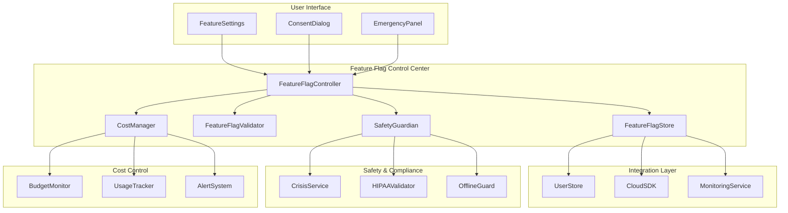

# FullMind Feature Flag System Architecture
## P0-CLOUD Phase 1 Control Center

---

## Executive Summary

This document defines the comprehensive feature flag system that serves as the control center for P0-CLOUD rollout. The system provides:

- **Progressive Rollout Control**: Granular feature activation with safety guards
- **Cost Management Integration**: Real-time budget controls with automatic limiting
- **Safety & Compliance**: Crisis features protected, HIPAA maintained throughout
- **User Consent Management**: Explicit consent for each cloud feature
- **Emergency Rollback**: Instant deactivation capabilities for safety

## Architecture Overview



## Core Feature Flag Architecture

### 1. Feature Flag Type Definitions

```typescript
/**
 * P0-CLOUD Feature Flag System
 * All flags default OFF to preserve offline functionality
 */

export interface P0CloudFeatureFlags {
  // Core Cloud Features
  readonly CLOUD_SYNC_ENABLED: boolean;
  readonly PAYMENT_SYSTEM_ENABLED: boolean;
  readonly THERAPIST_PORTAL_ENABLED: boolean;
  readonly ANALYTICS_ENABLED: boolean;
  readonly PUSH_NOTIFICATIONS_ENABLED: boolean;
  
  // Advanced Features
  readonly CROSS_DEVICE_SYNC_ENABLED: boolean;
  readonly AI_INSIGHTS_ENABLED: boolean;
  readonly FAMILY_SHARING_ENABLED: boolean;
  readonly EMERGENCY_CONTACTS_CLOUD: boolean;
  readonly BACKUP_RESTORE_ENABLED: boolean;
  
  // Development & Testing
  readonly BETA_FEATURES_ENABLED: boolean;
  readonly DEBUG_CLOUD_LOGS: boolean;
  readonly STAGING_ENVIRONMENT: boolean;
}

/**
 * Feature Flag Metadata for Control
 */
export interface FeatureFlagMetadata {
  readonly flagKey: keyof P0CloudFeatureFlags;
  readonly displayName: string;
  readonly description: string;
  readonly category: 'core' | 'premium' | 'experimental' | 'enterprise';
  readonly costImpact: 'none' | 'low' | 'medium' | 'high' | 'variable';
  readonly requiresConsent: boolean;
  readonly hipaaRelevant: boolean;
  readonly canDisableInCrisis: boolean;
  readonly dependencies: readonly (keyof P0CloudFeatureFlags)[];
  readonly minimumPlan: 'free' | 'premium' | 'family' | 'enterprise';
  readonly rolloutStrategy: 'immediate' | 'gradual' | 'controlled' | 'beta_only';
}

/**
 * Feature Flag State with Controls
 */
export interface FeatureFlagState {
  readonly flags: P0CloudFeatureFlags;
  readonly metadata: Record<keyof P0CloudFeatureFlags, FeatureFlagMetadata>;
  readonly userConsents: Record<keyof P0CloudFeatureFlags, boolean>;
  readonly rolloutPercentages: Record<keyof P0CloudFeatureFlags, number>;
  readonly costLimits: Record<keyof P0CloudFeatureFlags, number>;
  readonly emergencyOverrides: Record<keyof P0CloudFeatureFlags, boolean>;
  readonly lastUpdated: string;
  readonly version: string;
}
```

### 2. Progressive Rollout Control System

```typescript
/**
 * Progressive Rollout Manager
 * Controls gradual feature activation with safety guards
 */
export interface ProgressiveRolloutConfig {
  readonly strategy: 'percentage' | 'user_segments' | 'geographic' | 'plan_based';
  readonly phases: readonly RolloutPhase[];
  readonly safetyThresholds: RolloutSafetyThresholds;
  readonly emergencyBrake: EmergencyBrakeConfig;
}

export interface RolloutPhase {
  readonly phase: number;
  readonly targetPercentage: number;
  readonly duration: string; // ISO 8601 duration
  readonly criteria: RolloutCriteria;
  readonly successMetrics: readonly string[];
  readonly rollbackTriggers: readonly string[];
}

export interface RolloutCriteria {
  readonly userSegments?: readonly string[];
  readonly minimumAppVersion?: string;
  readonly geographicRegions?: readonly string[];
  readonly planTypes?: readonly string[];
  readonly betaOptIn?: boolean;
  readonly deviceTypes?: readonly ('ios' | 'android')[];
}

export interface RolloutSafetyThresholds {
  readonly maxErrorRate: number; // 0-1
  readonly maxLatencyMs: number;
  readonly minSuccessRate: number; // 0-1
  readonly maxCostPerUser: number; // USD
  readonly crisisResponseTimeMs: number; // Must stay <200ms
}

export interface EmergencyBrakeConfig {
  readonly enabled: boolean;
  readonly triggers: readonly ('error_rate' | 'latency' | 'cost' | 'compliance' | 'manual')[];
  readonly autoRollback: boolean;
  readonly notificationChannels: readonly string[];
  readonly escalationTimeoutMs: number;
}
```

### 3. Cost Management Integration

```typescript
/**
 * Cost Management for Feature Flags
 * Real-time monitoring and automatic limiting
 */
export interface FeatureCostManager {
  readonly budgetControls: BudgetControls;
  readonly usageTracking: UsageTracking;
  readonly costOptimization: CostOptimization;
  readonly alerting: CostAlerting;
}

export interface BudgetControls {
  readonly dailyBudget: number; // USD
  readonly weeklyBudget: number; // USD
  readonly monthlyBudget: number; // USD
  readonly perUserBudget: number; // USD
  readonly featureBudgets: Record<keyof P0CloudFeatureFlags, number>;
  readonly emergencyLimits: EmergencyBudgetLimits;
}

export interface EmergencyBudgetLimits {
  readonly hardStopPercentage: number; // 100% = disable all non-critical
  readonly warnPercentage: number; // 75% = start warnings
  readonly limitPercentage: number; // 85% = limit expensive features
  readonly criticalFeatures: readonly (keyof P0CloudFeatureFlags)[]; // Never disabled
}

export interface UsageTracking {
  readonly realTimeMonitoring: boolean;
  readonly aggregationIntervalMs: number;
  readonly costPerOperation: Record<string, number>;
  readonly projectedCosts: ProjectedCosts;
}

export interface ProjectedCosts {
  readonly daily: number;
  readonly weekly: number;
  readonly monthly: number;
  readonly confidence: number; // 0-1
  readonly basedOnUsers: number;
  readonly breakEvenUsers: number; // 50-100 per plan
}
```

### 4. Safety & Compliance Framework

```typescript
/**
 * Safety Guardian for Feature Flags
 * Ensures crisis features and HIPAA compliance maintained
 */
export interface FeatureSafetyGuardian {
  readonly crisisProtection: CrisisProtection;
  readonly hipaaCompliance: HIPAACompliance;
  readonly offlineFallback: OfflineFallback;
  readonly dataIntegrity: DataIntegrity;
}

export interface CrisisProtection {
  readonly protectedFeatures: readonly string[]; // Crisis button, 988 access, etc.
  readonly maxLatencyMs: 200; // Crisis response must stay <200ms
  readonly offlineMode: boolean; // Crisis works offline always
  readonly emergencyOverride: boolean; // Can override any flag in crisis
  readonly validationRules: readonly CrisisValidationRule[];
}

export interface CrisisValidationRule {
  readonly name: string;
  readonly condition: string; // JavaScript expression
  readonly action: 'disable_feature' | 'enable_offline' | 'alert' | 'escalate';
  readonly priority: 'critical' | 'high' | 'medium';
}

export interface HIPAACompliance {
  readonly encryptionRequired: boolean; // Always true
  readonly auditLogging: boolean; // All flag changes logged
  readonly accessControls: boolean; // User-based access
  readonly dataMinimization: boolean; // Only necessary data
  readonly consentTracking: boolean; // Explicit consent per feature
  readonly breachPrevention: BreachPrevention;
}

export interface BreachPrevention {
  readonly dataValidation: boolean;
  readonly encryptionValidation: boolean;
  readonly accessLogging: boolean;
  readonly anomalyDetection: boolean;
  readonly automaticDisable: boolean; // Disable on breach detection
}
```

## Integration Architecture

### 1. Zustand Store Integration

```typescript
/**
 * Feature Flag Store (Zustand)
 * Integrates with existing UserStore and CheckInStore
 */
export interface FeatureFlagStore {
  // State
  flags: P0CloudFeatureFlags;
  rolloutConfig: ProgressiveRolloutConfig;
  userEligibility: UserEligibility;
  costStatus: CostStatus;
  safetyStatus: SafetyStatus;
  
  // Actions
  evaluateFlag: (flag: keyof P0CloudFeatureFlags) => boolean;
  requestFeatureAccess: (flag: keyof P0CloudFeatureFlags) => Promise<FeatureAccessResult>;
  updateUserConsent: (flag: keyof P0CloudFeatureFlags, consent: boolean) => Promise<void>;
  emergencyDisable: (flag: keyof P0CloudFeatureFlags, reason: string) => Promise<void>;
  
  // Cost Controls
  checkCostLimits: () => CostLimitStatus;
  disableExpensiveFeatures: () => Promise<void>;
  
  // Safety Guards
  validateCrisisAccess: () => boolean;
  checkHIPAACompliance: () => HIPAAComplianceStatus;
  
  // Monitoring
  getFeatureUsage: (flag: keyof P0CloudFeatureFlags) => FeatureUsageStats;
  getHealthStatus: () => FeatureFlagHealthStatus;
}

export interface UserEligibility {
  readonly userId: string;
  readonly planType: 'free' | 'premium' | 'family' | 'enterprise';
  readonly rolloutSegment: string;
  readonly betaOptIn: boolean;
  readonly geographicRegion: string;
  readonly appVersion: string;
  readonly deviceType: 'ios' | 'android';
  readonly eligibleFeatures: readonly (keyof P0CloudFeatureFlags)[];
  readonly waitlistFeatures: readonly (keyof P0CloudFeatureFlags)[];
}
```

### 2. React Component Integration

```typescript
/**
 * Feature Flag Hooks for React Components
 */
export function useFeatureFlag(flag: keyof P0CloudFeatureFlags): FeatureFlagResult {
  const store = useFeatureFlagStore();
  
  return useMemo(() => ({
    enabled: store.evaluateFlag(flag),
    loading: store.isLoading,
    error: store.error,
    metadata: store.flags.metadata[flag],
    requestAccess: () => store.requestFeatureAccess(flag),
    hasConsent: store.userConsents[flag],
    updateConsent: (consent: boolean) => store.updateUserConsent(flag, consent)
  }), [flag, store]);
}

export function useProgressiveFeature(flag: keyof P0CloudFeatureFlags): ProgressiveFeatureResult {
  const featureFlag = useFeatureFlag(flag);
  const rolloutStatus = useFeatureFlagStore(state => state.rolloutConfig);
  
  return {
    ...featureFlag,
    rolloutPercentage: rolloutStatus.rolloutPercentages[flag],
    isInRollout: rolloutStatus.rolloutPercentages[flag] > 0,
    estimatedAvailability: calculateEstimatedAvailability(flag, rolloutStatus)
  };
}

export function useCostAwareFeature(flag: keyof P0CloudFeatureFlags): CostAwareFeatureResult {
  const featureFlag = useFeatureFlag(flag);
  const costStatus = useFeatureFlagStore(state => state.costStatus);
  
  return {
    ...featureFlag,
    costImpact: featureFlag.metadata.costImpact,
    currentCost: costStatus.featureCosts[flag],
    budgetRemaining: costStatus.budgetRemaining,
    costLimited: costStatus.limitedFeatures.includes(flag)
  };
}
```

## User Experience Design

### 1. Feature Settings Interface

```typescript
/**
 * User-Facing Feature Control Interface
 */
export interface FeatureSettingsUI {
  // Organized by Category
  categories: readonly FeatureCategory[];
  
  // Quick Access
  quickToggles: readonly QuickToggle[];
  
  // Status Overview
  statusOverview: FeatureStatusOverview;
  
  // Cost Transparency
  costBreakdown: CostBreakdown;
}

export interface FeatureCategory {
  readonly id: string;
  readonly name: string;
  readonly description: string;
  readonly icon: string;
  readonly features: readonly FeatureToggle[];
  readonly totalCost: number;
  readonly enabled: boolean;
}

export interface FeatureToggle {
  readonly flag: keyof P0CloudFeatureFlags;
  readonly displayName: string;
  readonly description: string;
  readonly benefits: readonly string[];
  readonly requirements: readonly string[];
  readonly costInfo: FeatureCostInfo;
  readonly status: FeatureToggleStatus;
  readonly actions: readonly FeatureAction[];
}

export interface FeatureCostInfo {
  readonly impact: 'free' | 'low' | 'medium' | 'high';
  readonly estimatedMonthlyCost: number;
  readonly includedInPlan: boolean;
  readonly usageBasedPricing: boolean;
  readonly transparencyMessage: string;
}

export interface FeatureToggleStatus {
  readonly available: boolean;
  readonly enabled: boolean;
  readonly hasConsent: boolean;
  readonly waitlisted: boolean;
  readonly rolloutPercentage: number;
  readonly costLimited: boolean;
  readonly reasonUnavailable?: string;
}
```

### 2. Consent Management Interface

```typescript
/**
 * Consent Management for Cloud Features
 */
export interface ConsentManagerUI {
  readonly consentFlows: ConsentFlow[];
  readonly privacyControls: PrivacyControl[];
  readonly dataTransparency: DataTransparency;
  readonly revocationProcess: RevocationProcess;
}

export interface ConsentFlow {
  readonly featureFlag: keyof P0CloudFeatureFlags;
  readonly steps: readonly ConsentStep[];
  readonly requiredConsents: readonly string[];
  readonly optionalConsents: readonly string[];
  readonly dataUsageDescription: string;
  readonly benefitsExplanation: string;
  readonly risksExplanation: string;
  readonly revocationInstructions: string;
}

export interface ConsentStep {
  readonly id: string;
  readonly title: string;
  readonly content: string;
  readonly consentType: 'required' | 'optional';
  readonly dataCategories: readonly string[];
  readonly thirdParties: readonly string[];
  readonly validationRules: readonly string[];
}
```

## Emergency Controls & Rollback

### 1. Emergency Rollback System

```typescript
/**
 * Emergency Controls for Critical Situations
 */
export interface EmergencyControlSystem {
  readonly triggers: EmergencyTrigger[];
  readonly responses: EmergencyResponse[];
  readonly escalation: EscalationProtocol;
  readonly recovery: RecoveryProcedure;
}

export interface EmergencyTrigger {
  readonly id: string;
  readonly name: string;
  readonly condition: string; // JavaScript expression
  readonly severity: 'low' | 'medium' | 'high' | 'critical';
  readonly autoActivate: boolean;
  readonly notificationRequired: boolean;
  readonly timeoutMs: number;
}

export interface EmergencyResponse {
  readonly triggerId: string;
  readonly actions: readonly EmergencyAction[];
  readonly timeline: EmergencyTimeline;
  readonly stakeholders: readonly string[];
}

export interface EmergencyAction {
  readonly type: 'disable_feature' | 'enable_offline' | 'notify_users' | 'escalate' | 'rollback';
  readonly target: string; // Feature flag or system component
  readonly priority: number;
  readonly automated: boolean;
  readonly requiresApproval: boolean;
  readonly rollbackable: boolean;
}
```

### 2. Health Monitoring Integration

```typescript
/**
 * Health Monitoring for Feature Flags
 */
export interface FeatureFlagHealthMonitor {
  readonly metrics: HealthMetrics;
  readonly alerts: HealthAlert[];
  readonly trends: HealthTrend[];
  readonly recommendations: HealthRecommendation[];
}

export interface HealthMetrics {
  readonly featureAvailability: Record<keyof P0CloudFeatureFlags, number>; // 0-1
  readonly responseLatency: Record<keyof P0CloudFeatureFlags, number>; // ms
  readonly errorRate: Record<keyof P0CloudFeatureFlags, number>; // 0-1
  readonly costEfficiency: Record<keyof P0CloudFeatureFlags, number>; // 0-1
  readonly userSatisfaction: Record<keyof P0CloudFeatureFlags, number>; // 0-1
  readonly adoptionRate: Record<keyof P0CloudFeatureFlags, number>; // 0-1
}

export interface HealthAlert {
  readonly id: string;
  readonly severity: 'info' | 'warning' | 'error' | 'critical';
  readonly feature: keyof P0CloudFeatureFlags | 'system';
  readonly message: string;
  readonly timestamp: string;
  readonly resolved: boolean;
  readonly actions: readonly string[];
}
```

## Implementation Strategy

### Phase 1: Foundation (Days 6-7)
1. **Core Types & Store Setup**
   - Implement feature flag type definitions
   - Create Zustand store with basic flag evaluation
   - Integrate with existing UserStore

2. **Safety Framework**
   - Implement crisis protection guards
   - Add HIPAA compliance validation
   - Create offline fallback mechanisms

### Phase 2: Progressive Rollout (Days 8-9)
1. **Rollout Engine**
   - Build percentage-based rollout system
   - Implement user eligibility evaluation
   - Add rollout phase management

2. **Cost Controls**
   - Integrate with existing cost monitoring
   - Add budget-based feature limiting
   - Implement real-time cost tracking

### Phase 3: User Experience (Days 10-11)
1. **Feature Settings UI**
   - Build categorized feature toggles
   - Implement consent management flows
   - Add cost transparency displays

2. **Emergency Controls**
   - Create emergency disable capabilities
   - Build health monitoring dashboard
   - Implement automated rollback triggers

### Phase 4: Production Hardening (Days 12-13)
1. **Monitoring Integration**
   - Connect to existing CloudMonitoring
   - Add feature-specific health checks
   - Implement alerting system

2. **Documentation & Training**
   - Create operational runbooks
   - Build troubleshooting guides
   - Implement user education flows

## Success Metrics

### Technical Metrics
- **Crisis Response Time**: Maintained <200ms always
- **Feature Availability**: >99.9% uptime for enabled features
- **Rollout Safety**: Zero critical incidents during rollouts
- **Cost Accuracy**: Budget variance <5%

### Business Metrics
- **User Adoption**: 40% of eligible users enable cloud features
- **Cost Efficiency**: Achieve break-even at 75 paying customers
- **Safety Record**: Zero crisis response degradation
- **Compliance**: 100% HIPAA compliance maintained

### User Experience Metrics
- **Consent Completion**: >90% completion rate for consent flows
- **Feature Satisfaction**: >4.5/5 rating for enabled features
- **Support Reduction**: <2% increase in support tickets
- **Rollback Rate**: <1% emergency rollbacks

## Risk Mitigation

### Critical Risks
1. **Crisis Response Degradation**: Multiple safety guards prevent any impact
2. **Budget Overrun**: Automated limiting prevents budget breaches
3. **HIPAA Compliance Breach**: Built-in validation ensures compliance
4. **Feature Flag Corruption**: Immutable defaults and validation prevent issues

### Mitigation Strategies
- **Defense in Depth**: Multiple validation layers
- **Graceful Degradation**: Offline fallbacks for all features
- **Immediate Rollback**: <5 second emergency disable capability
- **Continuous Monitoring**: Real-time health and cost tracking

This feature flag system serves as the robust, safe, and user-friendly control center for P0-CLOUD rollout, ensuring successful delivery while maintaining FullMind's core safety and privacy principles.