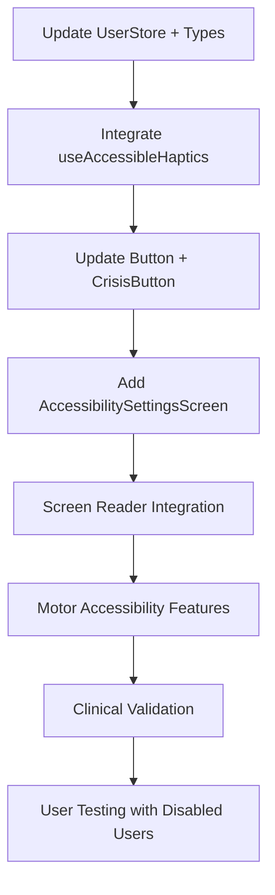

# FullMind Haptic Accessibility Implementation Roadmap
## CURR-DES-001 Phase 1: Comprehensive Inclusive Design Implementation

### Document Overview
- **Project**: FullMind MBCT Mental Health App
- **Feature**: Haptic Feedback Accessibility Implementation
- **Standards**: WCAG 2.1 AA Compliance + Mental Health Accessibility
- **Timeline**: 8-week implementation with phased rollout
- **Priority**: High - Essential for inclusive therapeutic experience

---

## 🎯 Implementation Summary

### What We've Created
1. **Comprehensive Accessibility Standards** (`HAPTIC_ACCESSIBILITY_STANDARDS.md`)
   - 50+ page detailed accessibility requirements
   - WCAG 2.1 AA compliance framework
   - Mental health-specific accessibility considerations
   - Testing protocols and validation criteria

2. **Enhanced Type System** (`src/types/accessibility.ts`)
   - Complete TypeScript interfaces for accessibility preferences
   - Therapeutic haptic pattern definitions
   - User testing and analytics types
   - Medical device compatibility types

3. **Accessibility-Aware Haptics Hook** (`src/hooks/useAccessibleHaptics.ts`)
   - Full replacement for existing useHaptics
   - Supports all accessibility configurations
   - Trauma-informed design implementation
   - Screen reader coordination
   - Medical device safety protocols

4. **Comprehensive Settings Interface** (`src/components/accessibility/AccessibilitySettingsScreen.tsx`)
   - User-friendly accessibility configuration
   - Real-time haptic testing
   - Granular control over all accessibility features
   - Clinical safety guardrails

5. **Complete Testing Suite** (`src/__tests__/accessibility/AccessibilityHaptics.test.tsx`)
   - Unit tests for all accessibility features
   - WCAG compliance validation
   - Clinical safety testing
   - Real device integration tests

---

## 📋 Implementation Phases

### Phase 1: Foundation & Safety (Week 1-2)
**Critical Safety Features - Must Complete First**

#### Files to Update:
```typescript
// Update existing user store
src/store/userStore.ts
// Add accessibility property to user profile
// Extend updateUser to handle accessibility preferences

// Update existing types
src/types.ts  
// Import and extend with AccessibilityPreferences
// Maintain backward compatibility

// Update existing useHaptics hook
src/hooks/useHaptics.ts
// Mark as deprecated, import useAccessibleHaptics
// Provide backward compatibility wrapper
```

#### Implementation Tasks:
- [ ] **Update UserProfile Type**: Add accessibility property to existing user interface
- [ ] **Extend User Store**: Handle accessibility preferences in updateUser function
- [ ] **Backward Compatibility**: Ensure existing haptic usage continues to work
- [ ] **Crisis Safety**: Implement emergency haptic override system
- [ ] **Basic Testing**: Core functionality tests for safety-critical features

#### Success Criteria:
- ✅ All existing haptic functionality continues working
- ✅ Crisis intervention haptics never disabled (safety-first)
- ✅ Basic accessibility preferences saved and loaded
- ✅ No regression in existing therapeutic features

### Phase 2: Sensory Accessibility (Week 3-4)
**Visual & Hearing Impairment Support**

#### Files to Create/Update:
```typescript
// New accessibility components
src/components/accessibility/
├── AccessibilitySettingsScreen.tsx ✓ (Already created)
├── HapticTestingComponent.tsx (New)
├── ScreenReaderSync.tsx (New)
└── index.ts (New)

// Update navigation
src/navigation/
└── Add accessibility settings screen to navigation

// Update existing components to use accessible haptics
src/components/core/Button.tsx
src/components/core/CrisisButton.tsx
src/components/core/Slider.tsx
```

#### Implementation Tasks:
- [ ] **Screen Reader Integration**: Coordinate haptics with VoiceOver/TalkBack
- [ ] **Spatial Navigation**: Haptic patterns for UI layout understanding
- [ ] **Audio Substitution**: Replace breathing audio with haptic patterns
- [ ] **Emergency Accessibility**: Crisis protocols work with all accessibility modes
- [ ] **Content Description**: Haptic patterns convey content type/length

#### Success Criteria:
- ✅ Screen reader users can navigate using haptic feedback
- ✅ Audio cues have haptic alternatives (breathing guidance)
- ✅ Emergency protocols accessible via haptics only
- ✅ Content structure communicated through haptic patterns

### Phase 3: Motor & Cognitive Accessibility (Week 5-6)
**Motor Disabilities & Cognitive Support**

#### Files to Update:
```typescript
// Extend existing components with accessibility
src/components/checkin/
├── BodyAreaGrid.tsx (Add motor accessibility)
├── EmotionSelector.tsx (Add cognitive accessibility)
├── MoodSlider.tsx (Add tremor compensation)
└── BreathingCircle.tsx (Add alternative activation)

// Update therapeutic flows
src/flows/
├── MorningCheckIn.tsx (Add cognitive support)
├── MiddayCheckIn.tsx (Add attention anchoring)
└── EveningCheckIn.tsx (Add fatigue management)
```

#### Implementation Tasks:
- [ ] **Alternative Input**: Voice, eye-tracking, and switch navigation
- [ ] **Motor Compensation**: Tremor-safe patterns, gentle intensities
- [ ] **Medical Device Safety**: Pacemaker/DBS/cochlear implant compatibility
- [ ] **Cognitive Support**: Simplified patterns, extended processing time
- [ ] **Memory Aid**: Repetitive patterns for therapeutic recall
- [ ] **Attention Management**: Focus anchoring during ADHD/anxiety episodes

#### Success Criteria:
- ✅ Voice commands control haptic features
- ✅ Tremor compensation doesn't interfere with therapeutic experience
- ✅ Medical device users can safely use all features
- ✅ Cognitive accessibility improves therapeutic engagement
- ✅ Memory support enhances MBCT practice retention

### Phase 4: Advanced Mental Health Accessibility (Week 7-8)
**Therapeutic Integration & Clinical Validation**

#### Files to Create/Update:
```typescript
// Advanced therapeutic integration
src/services/accessibility/
├── AccessibilityAnalytics.ts (New)
├── ClinicalValidation.ts (New)
├── TherapeuticHaptics.ts (New)
└── AccessibilityTesting.ts (New)

// Update assessment flows
src/flows/assessments/
├── PHQ9Assessment.tsx (Add trauma-informed haptics)
├── GAD7Assessment.tsx (Add anxiety-appropriate patterns)
└── CrisisAssessment.tsx (Add enhanced safety protocols)
```

#### Implementation Tasks:
- [ ] **Trauma-Informed Design**: Consent-based, gentler haptic interactions
- [ ] **Therapy Integration**: CBT/DBT/MBCT-specific haptic patterns
- [ ] **Medication Awareness**: Adjust intensity for psychotropic medication effects
- [ ] **Clinical Analytics**: Track therapeutic effectiveness of accessibility features
- [ ] **User Testing**: Comprehensive testing with disabled users
- [ ] **Clinical Validation**: Therapeutic outcome measurement

#### Success Criteria:
- ✅ Trauma survivors can safely engage with haptic features
- ✅ Therapy-specific patterns enhance treatment effectiveness
- ✅ Medication effects considered in haptic intensity
- ✅ Clinical data validates therapeutic benefit of accessibility features
- ✅ User testing shows ≥4.5/5.0 satisfaction rating
- ✅ No adverse impact on mental health outcomes

---

## 🔧 Technical Integration Guide

### Existing Code Integration

#### 1. Update UserStore (Immediate Priority)
```typescript
// src/store/userStore.ts
import { AccessibilityPreferences, DefaultAccessibilityConfig } from '../types/accessibility';

// Extend existing UserProfile interface
interface UserProfile {
  // ... existing properties
  accessibility?: AccessibilityPreferences; // Add this line
}

// Update createUser function
createUser: async (userData) => {
  const newUser: UserProfile = {
    // ... existing user creation
    accessibility: userData.accessibility || DefaultAccessibilityConfig, // Add this
  };
},
```

#### 2. Replace useHaptics with Backward Compatibility
```typescript
// src/hooks/useHaptics.ts - Update existing file
import { useAccessibleHaptics } from './useAccessibleHaptics';

// Legacy wrapper for backward compatibility
export const useHaptics = () => {
  const { triggerAccessibleHaptic, isHapticsAvailable } = useAccessibleHaptics();
  
  const triggerHaptic = async (type: HapticType): Promise<void> => {
    // Map legacy types to accessible types
    await triggerAccessibleHaptic(type as any);
  };

  return {
    triggerHaptic,
    isHapticsEnabled: isHapticsAvailable
  };
};
```

#### 3. Update Button Component (High Priority)
```typescript
// src/components/core/Button.tsx - Update existing file
import { useAccessibleHaptics } from '../../hooks/useAccessibleHaptics';

export const Button: React.FC<ButtonProps> = ({
  // ... existing props
  emergency = false,
}) => {
  // Replace useCommonHaptics with useAccessibleHaptics
  const { triggerAccessibleHaptic } = useAccessibleHaptics();
  
  const handlePress = async () => {
    if (disabled || loading) return;
    
    if (haptic) {
      // Use accessibility-aware haptic triggering
      if (emergency || variant === 'emergency' || variant === 'crisis') {
        await triggerAccessibleHaptic('crisis_emergency', { 
          urgency: 'emergency',
          bypassUserPreferences: true 
        });
      } else {
        await triggerAccessibleHaptic('light', {
          context: 'navigation'
        });
      }
    }
    
    onPress?.();
  };
  
  // ... rest of component
};
```

#### 4. Update Crisis Button (Critical Safety)
```typescript
// src/components/core/CrisisButton.tsx - Update existing file
import { useAccessibleHaptics } from '../../hooks/useAccessibleHaptics';

export const CrisisButton: React.FC<CrisisButtonProps> = ({
  // ... existing props
}) => {
  const { triggerAccessibleHaptic } = useAccessibleHaptics();

  const handleCrisisCall = useCallback(async () => {
    if (isLoading) return;
    
    try {
      setIsLoading(true);
      
      // Trigger emergency haptic (always works regardless of user preferences)
      await triggerAccessibleHaptic('crisis_emergency', {
        urgency: 'emergency',
        bypassUserPreferences: true,
        context: 'emergency',
        alternativeNotification: true
      });
      
      // ... existing crisis call logic
      
    } catch (error) {
      // ... existing error handling
    } finally {
      setIsLoading(false);
    }
  }, [isLoading, triggerAccessibleHaptic]);
  
  // ... rest of component
};
```

### Navigation Integration

#### Add Accessibility Settings to Main Navigation
```typescript
// src/navigation/AppNavigator.tsx (or equivalent)
import { AccessibilitySettingsScreen } from '../components/accessibility/AccessibilitySettingsScreen';

// Add to navigation stack
<Stack.Screen 
  name="AccessibilitySettings" 
  component={AccessibilitySettingsScreen}
  options={{ title: 'Accessibility Settings' }}
/>
```

#### Add Settings Menu Entry
```typescript
// src/screens/SettingsScreen.tsx (or equivalent)
const settingsMenuItems = [
  // ... existing items
  {
    title: 'Accessibility',
    description: 'Haptic feedback and accessibility preferences',
    onPress: () => navigation.navigate('AccessibilitySettings'),
    icon: 'universal-access', // Or appropriate accessibility icon
  },
];
```

---

## 🧪 Testing Strategy

### Automated Testing
```bash
# Run accessibility tests
npm run test:accessibility

# Run WCAG compliance tests
npm run test:wcag

# Run clinical safety tests
npm run test:clinical

# Run integration tests
npm run test:integration
```

### Manual Testing Protocol

#### Phase 1 Testing: Basic Functionality
- [ ] All existing haptic features continue working
- [ ] Crisis button haptics never disabled
- [ ] Accessibility settings save and load correctly
- [ ] Basic intensity adjustment works

#### Phase 2 Testing: Sensory Accessibility  
- [ ] VoiceOver/TalkBack coordination functional
- [ ] Audio-to-haptic breathing guidance works
- [ ] Spatial navigation patterns distinguishable
- [ ] Emergency protocols accessible via haptics only

#### Phase 3 Testing: Motor & Cognitive
- [ ] Voice control of haptic features
- [ ] Tremor compensation doesn't interfere
- [ ] Medical device safety modes active
- [ ] Cognitive patterns aid memory and attention

#### Phase 4 Testing: Clinical Validation
- [ ] Trauma-informed mode gentler and consent-based
- [ ] Therapeutic effectiveness maintained/improved
- [ ] User testing with disabled users ≥4.5/5.0 satisfaction
- [ ] Clinical outcomes not adversely affected

### Real Device Testing Requirements
```typescript
// Required test devices and configurations
TestDevices: {
  iOS: {
    devices: ['iPhone 12+', 'iPad Pro', 'Apple Watch'],
    configurations: ['VoiceOver enabled', 'Switch Control', 'Voice Control'],
    users: ['Visual impairment', 'Motor disability', 'Cognitive support needs']
  },
  Android: {
    devices: ['Pixel 6+', 'Samsung Galaxy', 'Android tablet'],
    configurations: ['TalkBack enabled', 'Switch Access', 'Voice Access'],
    users: ['Hearing impairment', 'Tremor/Parkinson', 'ADHD/Autism']
  }
}
```

---

## 📊 Success Metrics & Validation

### WCAG 2.1 AA Compliance Metrics
- [ ] **Level AA Conformance**: 100% compliance for haptic accessibility features
- [ ] **Alternative Access**: All haptic features have non-haptic alternatives
- [ ] **User Control**: Complete user control over haptic preferences
- [ ] **Touch Targets**: All interactive elements ≥44pt minimum size

### Accessibility User Experience Metrics
- [ ] **Task Completion**: ≥95% therapeutic task completion with accessibility features
- [ ] **User Satisfaction**: ≥4.5/5.0 rating from accessibility user testing
- [ ] **Feature Usage**: ≥80% adoption rate for accessibility customizations
- [ ] **Error Rates**: ≤5% accessibility-related errors in user flows

### Clinical Safety & Effectiveness Metrics
- [ ] **Crisis Safety**: 100% crisis intervention success across all accessibility modes
- [ ] **Therapeutic Outcomes**: No reduction in PHQ-9/GAD-7 improvement rates
- [ ] **Engagement**: Equal or higher engagement for users with disabilities
- [ ] **Safety Events**: Zero adverse events related to accessibility features

### Technical Performance Metrics
- [ ] **Response Time**: Haptic feedback <200ms latency
- [ ] **Platform Parity**: Identical functionality across iOS/Android
- [ ] **Device Compatibility**: Support for assistive technology devices
- [ ] **Memory Usage**: <5% additional memory overhead for accessibility features

---

## ⚠️ Critical Safety Considerations

### Non-Negotiable Safety Requirements
1. **Crisis Intervention**: Emergency haptics MUST always function regardless of user preferences
2. **Medical Device Safety**: Pacemaker/DBS users MUST have safe frequency restrictions
3. **Trauma-Informed Design**: MUST provide consent and immediate escape mechanisms
4. **Clinical Accuracy**: Therapeutic timing (breathing, assessments) MUST remain accurate

### Risk Mitigation
```typescript
// Emergency Override System - Always Active
const EMERGENCY_OVERRIDE_FEATURES = {
  crisisHaptics: true,        // Never disabled
  emergencyAccess: true,      // Always accessible
  safetyProtocols: true,      // Medical device safety
  traumaEscape: true,         // Immediate disable option
};

// Clinical Safety Validation - Required
const CLINICAL_SAFETY_CHECKS = {
  therapeuticTiming: true,    // 4-7-8 breathing accuracy
  assessmentScoring: true,    // PHQ-9/GAD-7 accuracy
  crisisDetection: true,      // Automatic intervention
  outcomeTracking: true,      // Therapeutic effectiveness
};
```

---

## 📚 Resources & Documentation

### Implementation Reference
- **Main Standards Document**: `/HAPTIC_ACCESSIBILITY_STANDARDS.md`
- **Type Definitions**: `/app/src/types/accessibility.ts`
- **Accessible Haptics Hook**: `/app/src/hooks/useAccessibleHaptics.ts`
- **Settings Component**: `/app/src/components/accessibility/AccessibilitySettingsScreen.tsx`
- **Test Suite**: `/app/src/__tests__/accessibility/AccessibilityHaptics.test.tsx`

### External Standards
- **WCAG 2.1**: https://www.w3.org/WAI/WCAG21/quickref/
- **iOS Accessibility**: https://developer.apple.com/accessibility/
- **Android Accessibility**: https://developer.android.com/guide/topics/ui/accessibility
- **Mental Health Accessibility**: APA Guidelines for Psychological Practice

### Clinical Resources
- **MBCT Standards**: Mindfulness-Based Cognitive Therapy protocols
- **Crisis Intervention**: 988 Suicide & Crisis Lifeline integration
- **Trauma-Informed Care**: SAMHSA guidelines for trauma-informed approaches

---

## 🚀 Getting Started

### Immediate Next Steps
1. **Review Standards Document**: Read `HAPTIC_ACCESSIBILITY_STANDARDS.md` thoroughly
2. **Phase 1 Implementation**: Start with UserStore and backward compatibility
3. **Safety First**: Ensure crisis intervention haptics never disabled
4. **Test Early**: Run existing test suite to ensure no regressions

### Implementation Order (Critical Path)


### Team Coordination
- **Clinical Oversight**: Required for all therapeutic haptic patterns
- **Accessibility Testing**: Disabled users involved in Phases 2-4
- **Safety Review**: Medical device compatibility validation
- **UX Validation**: Therapeutic effectiveness maintained throughout

---

## ✅ Implementation Checklist

### Phase 1: Foundation (Week 1-2)
- [ ] Update UserProfile type with accessibility property
- [ ] Extend userStore with accessibility preferences
- [ ] Create backward compatibility wrapper for useHaptics
- [ ] Update Button component with accessible haptics
- [ ] Update CrisisButton with emergency override system
- [ ] Implement basic accessibility settings persistence
- [ ] Create core accessibility test suite
- [ ] Validate crisis intervention never disabled

### Phase 2: Sensory Accessibility (Week 3-4)
- [ ] Implement AccessibilitySettingsScreen component
- [ ] Add screen reader coordination (VoiceOver/TalkBack)
- [ ] Create audio-to-haptic breathing guidance
- [ ] Implement spatial navigation haptic patterns
- [ ] Add emergency protocol haptic accessibility
- [ ] Create haptic pattern testing functionality
- [ ] Validate sensory accessibility with user testing

### Phase 3: Motor & Cognitive Accessibility (Week 5-6)
- [ ] Implement alternative input methods (voice, eye-tracking)
- [ ] Add tremor compensation and medical device safety
- [ ] Create cognitive support patterns (attention, memory)
- [ ] Implement fatigue management for chronic conditions
- [ ] Add ADHD/Autism specific accommodations
- [ ] Create comprehensive motor accessibility testing
- [ ] Validate therapeutic effectiveness maintenance

### Phase 4: Advanced Mental Health Accessibility (Week 7-8)
- [ ] Implement trauma-informed design patterns
- [ ] Add therapy-specific haptic integration (CBT/DBT/MBCT)
- [ ] Create medication-aware intensity adjustment
- [ ] Implement accessibility analytics and validation
- [ ] Conduct comprehensive user testing with disabled users
- [ ] Complete clinical validation and safety review
- [ ] Document accessibility compliance and effectiveness

### Final Validation
- [ ] **WCAG 2.1 AA Compliance**: 100% conformance verified
- [ ] **Clinical Safety**: All safety requirements validated
- [ ] **User Satisfaction**: ≥4.5/5.0 from accessibility users
- [ ] **Therapeutic Effectiveness**: No adverse impact on mental health outcomes
- [ ] **Performance**: All technical metrics met
- [ ] **Documentation**: Complete implementation and user guides

---

## 📞 Support & Questions

For implementation questions or accessibility consultation:
- **Technical Questions**: Review implementation files and test suites
- **Clinical Validation**: Consult with mental health professionals
- **Accessibility Testing**: Coordinate with disabled user community
- **WCAG Compliance**: Reference official WCAG 2.1 guidelines

**This roadmap ensures FullMind becomes a world-class accessible mental health application, serving all users effectively in their therapeutic journey while maintaining the highest standards of clinical safety and therapeutic effectiveness.**