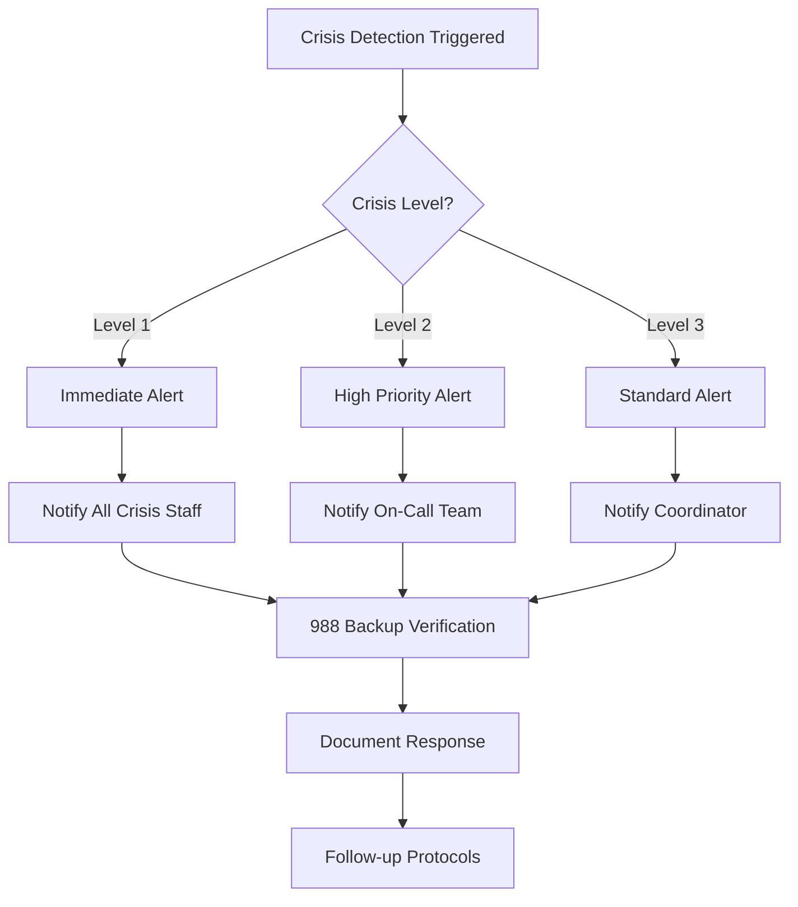

# FullMind Crisis Incident Response Plan

## Overview

This document outlines the emergency response procedures for crisis incidents within the FullMind mental health application. All staff must be familiar with these procedures to ensure immediate and appropriate response to user safety situations.

## Crisis Classification Levels

### Level 1: Immediate Danger
- User expressing active suicidal ideation with plan and means
- User reporting active self-harm
- User in immediate physical danger
- App malfunction during active crisis (crisis detection failure)

**Response Time**: < 60 seconds
**Staff Involvement**: All available crisis team members

### Level 2: High Risk
- PHQ-9 score ≥ 20 (severe depression)
- GAD-7 score ≥ 15 (severe anxiety)
- User accessing crisis resources repeatedly
- Crisis button activation

**Response Time**: < 3 minutes
**Staff Involvement**: On-call crisis coordinator + technical lead

### Level 3: Moderate Risk
- Multiple consecutive high-severity assessments
- User reports concerning check-in responses
- App performance issues affecting crisis features

**Response Time**: < 15 minutes
**Staff Involvement**: On-call crisis coordinator

## Emergency Response Workflows

### 1. Crisis Detection Alert Workflow



### 2. Staff Notification Procedures

#### Immediate Notification (Level 1)
1. **Automated Systems**: Crisis monitoring dashboard alerts
2. **Primary Contact**: Crisis Team Lead (24/7 on-call rotation)
3. **Secondary Contact**: Clinical Director
4. **Backup Contact**: CTO for technical crisis failures
5. **Emergency Escalation**: Company emergency contact tree

#### Contact Information (Update Quarterly)
```
Crisis Team Lead: [ENCRYPTED - See Staff Directory]
Clinical Director: [ENCRYPTED - See Staff Directory] 
CTO: [ENCRYPTED - See Staff Directory]
Emergency Hotline: 988 (Primary), 911 (Life-threatening)
```

### 3. 988 Suicide & Crisis Lifeline Integration

#### Primary Integration Protocol
- **Direct Calling**: App automatically dials 988 on crisis button press
- **Response Time**: < 200ms from button press to call initiation
- **Fallback Mechanism**: Manual dial instructions if automated calling fails
- **Accessibility**: Voice activation available for motor-impaired users

#### Integration Verification
- **Daily Testing**: Automated 988 connectivity check (non-call verification)
- **Weekly Review**: Crisis response time metrics
- **Monthly Audit**: Complete crisis flow testing with test accounts

#### Backup Crisis Resources
1. **Crisis Text Line**: Text HOME to 741741
2. **Veterans Crisis Line**: 1-800-273-8255 (Press 1)
3. **Trans Lifeline**: 877-565-8860
4. **Local Emergency**: 911
5. **International**: Provided based on device location

### 4. App Malfunction During Crisis Response

#### Crisis Feature Failure Protocol
1. **Immediate Assessment** (< 30 seconds)
   - Verify scope of failure (single user vs. system-wide)
   - Check crisis detection system status
   - Verify 988 calling functionality

2. **Emergency Bypass Activation** (< 60 seconds)
   - Activate emergency override mode
   - Display emergency contact information directly
   - Bypass all non-essential app functions

3. **Technical Response** (< 3 minutes)
   - Deploy hotfix if available
   - Activate backup crisis detection system
   - Notify app store for expedited review if needed

4. **User Communication** (< 5 minutes)
   - Push notification with alternative crisis resources
   - Email backup crisis information
   - Update app status page

#### System Monitoring for Crisis Features
- **Real-time Monitoring**: Crisis button response time (< 3 seconds target)
- **Automated Testing**: Crisis detection algorithms (every 15 minutes)
- **Performance Metrics**: Assessment scoring accuracy (100% target)
- **Failure Detection**: Automatic alerting on any crisis system degradation

## Emergency Contact Protocols

### User Emergency Contacts
- **Setup Requirement**: Optional but strongly encouraged during onboarding
- **Privacy Protection**: Encrypted storage, user-controlled access
- **Crisis Activation**: Automatic notification with user consent
- **Content Templates**: Pre-written crisis communication messages

### Emergency Contact Communication Templates

#### Template 1: Assessment-Triggered Crisis
```
Subject: [Name] - Mental Health Check-in Alert

[Contact Name],

[User's First Name] has indicated they are experiencing significant distress through their mental health assessment. They have listed you as someone they trust for support.

This is not an emergency requiring immediate intervention, but your support and check-in would be valuable.

Resources available:
- Crisis Text Line: Text HOME to 741741
- Suicide & Crisis Lifeline: 988
- Local emergency services: 911

This message was sent with [User's First Name]'s consent through the FullMind mental health app.
```

#### Template 2: Crisis Button Activation
```
Subject: [Name] - Immediate Support Requested

[Contact Name],

[User's First Name] has activated their crisis support system and indicated they need immediate help. They have chosen to include you in their support network.

Please reach out to them as soon as possible. If you believe they are in immediate danger, please call 911.

Immediate resources:
- Suicide & Crisis Lifeline: 988 (24/7, free, confidential)
- Crisis Text Line: Text HOME to 741741
- Emergency Services: 911

This message was sent with [User's First Name]'s explicit consent during a crisis situation.
```

## Staff Roles and Responsibilities

### Crisis Team Lead (24/7 On-Call Rotation)
- **Primary Response**: All Level 1 and Level 2 incidents
- **Decision Authority**: Crisis response escalation and resource allocation
- **Clinical Oversight**: Validate crisis detection accuracy
- **Communication Lead**: Coordinate with external crisis services

### Clinical Director
- **Clinical Validation**: Review and approve crisis threshold modifications
- **Staff Training**: Monthly crisis response training
- **Quality Assurance**: Crisis response effectiveness review
- **External Relations**: Liaison with 988 and other crisis services

### Technical Lead (On-Call)
- **System Response**: Technical crisis feature failures
- **Performance Monitoring**: Crisis system performance and reliability
- **Emergency Deployment**: Hotfix deployment for crisis-related bugs
- **Infrastructure**: Crisis system scaling and redundancy

### Customer Support (Crisis-Trained)
- **User Communication**: Non-clinical crisis support coordination
- **Resource Provision**: Help users access crisis resources
- **Documentation**: Crisis incident logging and follow-up
- **Escalation**: Know when to involve clinical crisis team

## Documentation and Follow-up

### Incident Documentation Requirements
1. **Timestamp**: Exact time of crisis detection/escalation
2. **Assessment Data**: Anonymous crisis scores and triggers
3. **Response Actions**: All steps taken and resources provided
4. **Resolution**: Outcome and follow-up completed
5. **Lessons Learned**: Process improvements identified

### Post-Crisis Follow-up Protocol
- **24-Hour Review**: Crisis response effectiveness assessment
- **48-Hour Check**: User safety confirmation (if consent provided)
- **7-Day Analysis**: System performance during crisis response
- **30-Day Report**: Trends analysis and process improvements

### Privacy and Legal Compliance
- **HIPAA Awareness**: Maintain user privacy during crisis response
- **Consent Management**: Only contact emergency contacts with explicit user consent
- **Data Retention**: Crisis response logs retained per legal requirements
- **Audit Trail**: Complete documentation for legal and clinical review

## Training and Preparedness

### Monthly Requirements
- **Crisis Response Drill**: Simulated crisis scenarios with full team
- **System Testing**: Complete crisis detection and response system test
- **Process Review**: Update procedures based on latest incidents
- **Resource Verification**: Confirm all crisis resource contact information

### Quarterly Requirements
- **Staff Recertification**: Crisis response training renewal
- **External Coordination**: Meeting with 988 and local crisis services
- **Technology Audit**: Third-party security review of crisis systems
- **Legal Review**: Compliance audit of crisis response procedures

### Annual Requirements
- **Comprehensive Review**: Full crisis response system evaluation
- **Process Overhaul**: Major updates based on year's learnings
- **Emergency Contact Update**: Refresh all staff emergency contact information
- **Regulatory Compliance**: Update procedures for any new legal requirements

## Continuous Improvement

### Metrics and KPIs
- **Response Time**: Average time from crisis detection to resource provision
- **Success Rate**: Percentage of crises resolved without escalation
- **User Satisfaction**: Post-crisis feedback on response effectiveness
- **System Reliability**: Crisis feature uptime and performance metrics

### Feedback Integration
- **User Feedback**: Anonymous feedback on crisis response experience
- **Staff Input**: Monthly team retrospectives on crisis response
- **External Partners**: Feedback from 988 and other crisis services
- **Clinical Review**: Professional assessment of crisis response quality

---

**Document Control**
- **Version**: 1.0
- **Last Updated**: 2024-09-10
- **Next Review**: 2024-12-10
- **Owner**: Crisis Team Lead
- **Approvals**: Clinical Director, CTO, Legal Counsel