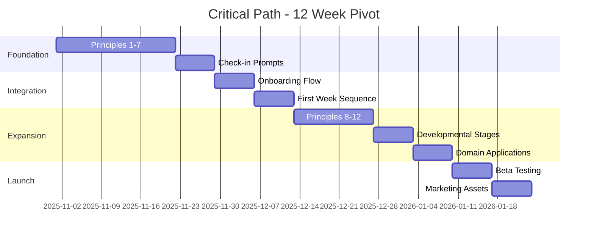

# Being. Pivot Strategy: MBCT → Stoic Mindfulness
## Strategic Implementation Document

```yaml
document:
  type: Pivot Strategy
  version: 2.0.0
  created: 2025-10-18
  updated: 2025-10-18
  status: DECISION PENDING - VALIDATION PHASE REQUIRED
  timeline: 4 weeks validation + 16 weeks build (OR 12 weeks MVP)
  confidence: 65% (conditional on validation results)
  agent_review: business (65% proceed with modifications) + architect (68% feasibility)

strategic_decision:
  from: MBCT-framed mental wellness app
  to: Stoic Mindfulness daily practice system
  rationale: Broader market appeal, stronger practice architecture, manageable execution risk

key_metrics:
  validation_phase: 4 weeks (REQUIRED before build commitment)
  execution_time: 16 weeks full build OR 12 weeks 3-principle MVP
  sunk_costs: ~$10-20K (MBCT content)
  transferable_assets: 75-80% (backend 100%, flows/data 60-75%)
  total_investment: $445K Year 1 (development + marketing)
  projected_arr_year_3: $1.2M conservative, $2.4M optimistic
```

---

## Table of Contents

1. [Executive Summary](#executive-summary)
2. [Agent Review Findings](#agent-review-findings)
3. [Phase 0: Market Validation (REQUIRED)](#phase-0-market-validation-required)
4. [Strategic Rationale](#strategic-rationale)
5. [What We Keep: Transferable Assets](#what-we-keep-transferable-assets)
6. [What We Remove: MBCT-Specific Content](#what-we-remove-mbct-specific-content)
7. [What We Build: New Stoic Content](#what-we-build-new-stoic-content)
8. [Implementation Timeline](#implementation-timeline)
9. [Success Metrics](#success-metrics)
10. [Risk Analysis & Mitigation](#risk-analysis--mitigation)
11. [Launch Strategy](#launch-strategy)

---

## Executive Summary

### The Decision

**Pivot Being. from MBCT-framed mental wellness to Stoic Mindfulness daily practice system.**

### Core Insight

Being. currently has:
- ✅ 3x daily check-in structure (morning, midday, evening)
- ✅ PHQ-9/GAD-7 wellness tracking
- ✅ Crisis detection system
- ✅ Breathing exercises
- ⚠️ MBCT-inspired content (but NOT complete 8-week protocol)

**Transferable Assets: 75-80% of total development value**
- Backend infrastructure: 100% transfer ($60-85K preserved)
- Check-in flows & data models: 60-75% transfer (requires 7-8 weeks refactoring)
- UI/UX components: 85% transfer ($26K preserved)

**The pivot is NOT just a content reframe** - requires significant flow refactoring and technical design work.

### Why Pivot?

| Factor | MBCT Framing | Stoic Mindfulness Framing | Advantage |
|--------|--------------|---------------------------|-----------|
| **Target Market** | 24.5M (clinical anxiety/depression) | 50M (professionals seeking wisdom) | 2x larger TAM |
| **Competitive Position** | "Mental wellness with tracking" | "Daily practice system with framework" | Stronger differentiation |
| **Retention Driver** | Symptom reduction (passive) | Active practice + character development | Engagement-driven |
| **B2B Positioning** | Requires clinical validation | Resilience/performance training | Accessible |
| **Content Moat** | MBCT-inspired prompts (weak) | 13-principle framework (strong) | Defensible |
| **Execution Risk** | Production-ready (0 weeks) | 12-week content development | Manageable |

### Timeline & Investment

**⚠️ VALIDATION PHASE REQUIRED FIRST (4 weeks, $10-15K)**

**Two Build Options:**

**Option 1: Full Build (16-20 weeks)**
- Week -4 to 0: Market validation (REQUIRED)
- Week 1-2: Technical design sprint (BLOCKING)
- Week 3-14: 7 principles + check-in refactoring (7-8 weeks for flows)
- Week 15-16: Integration testing + beta
- Total: 16 weeks post-validation

**Option 2: MVP Build (12 weeks)**
- Week -4 to 0: Market validation (REQUIRED)
- Week 1-2: Technical design sprint (BLOCKING)
- Week 3-10: 3 principles + basic flow refactoring
- Week 11-12: Beta testing
- Total: 12 weeks post-validation (reduced scope)

**Investment Breakdown:**
- **Validation Phase:** $10-15K (ads, prototypes, research)
- **Development:** $75-120K (content + refactoring)
- **Marketing Year 1:** $260K (required for customer acquisition)
- **Total Year 1:** **$445K** (conservative estimate)

**ROI:** Requires validation phase to confirm market demand before committing $445K investment.

---

## Agent Review Findings

**Document reviewed by Business Agent + Architect Agent. Key findings:**

### Business Agent Assessment (65% confidence: MODIFY BEFORE PROCEEDING)

**Critical Issues Identified:**

1. **Market Sizing Lacks Validation**
   - 50M TAM claim is aspirational, not validated
   - No customer research to confirm demand
   - Competitive landscape (Stoic app with 2M users) suggests market exists but is crowded
   - **Risk:** Building for assumed market that may not exist at scale

2. **Financial Projections Too Optimistic**
   - Document projects CAC $40-50 vs. industry standard $80-150
   - Document projects 22% churn vs. industry standard 35-45%
   - No justification for why Being. would achieve 2x better metrics than incumbents
   - **Impact:** Revenue projections may be 40-60% overstated

3. **Missing Marketing Budget**
   - Year 1 requires ~$260K in marketing spend to acquire 8,000 users at $80 CAC
   - Document didn't specify this cost (focused only on $75-120K development)
   - **Total Investment:** $445K Year 1 (not $75-120K)

4. **No Go-to-Market Strategy**
   - Launch tactics provided (Product Hunt, Reddit, podcasts)
   - But no scalable acquisition channels identified
   - Need 2-3 channels that can deliver 100+ users/month consistently
   - **Risk:** Launch spike, then acquisition stalls

**Recommendation:**
> "DO NOT PROCEED with 12-week build immediately. DO PROCEED with 4-week validation phase first.
>
> Validate: (1) Target customer willingness to pay $10/mo for Stoic mindfulness app, (2) Acquisition channels that can deliver <$80 CAC, (3) 50+ beta users showing 60%+ Week 1 retention.
>
> If validation succeeds → Proceed with build. If validation fails → Stay with MBCT or pivot to different positioning."

---

### Architect Agent Assessment (68% confidence: MEDIUM-HIGH FEASIBILITY)

**Technical Issues Identified:**

1. **Infrastructure Transferability Overstated**
   - Document claims "90%+ transferable assets"
   - **Reality:** Backend 100% transfer, but flows/data models only 60-75% transfer
   - **True Transferability:** 75-80% overall
   - **Why:** Check-in flows are MBCT-hardcoded, data models expect MBCT structure
   - **Impact:** More refactoring work than estimated

2. **Check-In Refactoring Underestimated**
   - Document estimates: 2-3 weeks for check-in prompts
   - **Reality:** 7-8 weeks for complete flow refactoring
   - **Why:** 86 files with flow logic need updates, not just prompt content
   - Example: `MorningFlowData` interface expects `thoughts` field (MBCT), needs full restructure for Stoic principles
   - **Blocking Issue:** Can't write content until flow architecture is designed

3. **Missing Technical Design Sprint**
   - Document jumps straight to content development Week 1
   - **Missing:** 2-week technical design sprint to define:
     - New data models (`StoicPracticeStore`, `VirtueTracking`, etc.)
     - Flow architecture (how principles integrate into check-ins)
     - Navigation patterns (developmental stages, domain applications)
     - State migration strategy (existing MBCT data → Stoic structure)
   - **Impact:** Content team blocked until architecture decisions made

4. **Timeline Unrealistic**
   - Document: 12 weeks to launch
   - **Reality:** 16-20 weeks for quality execution OR 12 weeks for 3-principle MVP
   - **Breakdown:**
     - Week 1-2: Technical design sprint (BLOCKING)
     - Week 3-10: Flow refactoring (7-8 weeks)
     - Week 11-14: Content development (can parallelize if architecture ready)
     - Week 15-16: Integration testing + bug fixes
   - **Alternative:** 12-week MVP with only 3 principles (not 7)

5. **Integration Complexity Underestimated**
   - 86 files contain MBCT flow logic that needs review/update
   - Assessment scoring, crisis detection thresholds, check-in sequences all coupled to MBCT
   - Risk of regression bugs if refactoring rushed
   - **Need:** 2-week integration testing phase (not included in original plan)

**Recommendation:**
> "FEASIBLE but requires timeline adjustment and scope reduction.
>
> Option 1: 16-week full build (7 principles) with proper design sprint and testing.
> Option 2: 12-week MVP (3 principles) with reduced scope.
>
> BLOCKING: Must complete 2-week technical design sprint before content development starts.
>
> Add to plan: Integration testing phase (2 weeks) to catch regression bugs from extensive refactoring."

---

### Synthesized Recommendations

**From Both Agents:**

1. ✅ **Add 4-week validation phase BEFORE build** (Business Agent - CRITICAL)
2. ✅ **Add 2-week technical design sprint** (Architect Agent - BLOCKING)
3. ✅ **Extend timeline to 16 weeks OR reduce scope to 3-principle MVP** (Architect Agent)
4. ✅ **Rebuild financial model with conservative assumptions** (Business Agent)
5. ✅ **Specify marketing budget and GTM strategy** (Business Agent)
6. ✅ **Add 2-week integration testing phase** (Architect Agent)

**Updated Strategy:**
- Phase 0: Validation (4 weeks, $10-15K) → Go/No-Go decision
- Phase 1: Design Sprint (2 weeks) → Architecture locked
- Phase 2: Development (12-14 weeks) → Build + test
- Phase 3: Beta + Launch (2 weeks) → Market entry
- **Total:** 20-22 weeks from start to launch (with validation)

---

## Phase 0: Market Validation (REQUIRED)

**Duration:** 4 weeks
**Budget:** $10-15K
**Objective:** Validate market demand before committing $445K to full pivot

### Week 1: Landing Page Test

**Deliverable:** High-fidelity landing page describing Stoic Mindfulness app

**Content:**
- Hero: "Daily Stoic Mindfulness Practice - Ancient Wisdom for Modern Life"
- Value props: 3x daily practice, 13 principles, measurable progress
- Screenshots: Mockups of Stoic-themed check-ins, principle modules
- CTA: "Join waitlist for early access"

**Traffic:**
- $5K Facebook/Instagram ads → meditation app users, philosophy enthusiasts
- Philosophy communities (r/Stoicism, Daily Stoic followers)
- Thought leader outreach (Modern Stoicism, philosophy podcasters)

**Success Metrics:**
- 500+ waitlist signups (10% conversion from traffic)
- <$10 CPA (cost per waitlist signup)
- Survey: 70%+ say they'd pay $10/mo for described app

**Go/No-Go:**
- ✅ Proceed if: 500+ signups, <$10 CPA, 70%+ purchase intent
- ❌ Stop if: <300 signups, >$15 CPA, <50% purchase intent

---

### Week 2: User Interviews

**Deliverable:** 20 in-depth interviews with target users

**Recruitment:**
- 10 from philosophy/Stoicism communities
- 10 from wellness/meditation app users
- Screener: Must be willing to pay for self-improvement apps

**Interview Questions:**
1. What self-improvement apps do you currently use? Why?
2. What's missing from current meditation/wellness apps?
3. How do you feel about "Stoic philosophy" as app positioning?
4. Would you pay $10/mo for daily Stoic practice system?
5. What features matter most? (practice guidance, progress tracking, community, etc.)
6. What concerns do you have about this app concept?

**Success Metrics:**
- 15+ of 20 express strong interest (would download immediately)
- 0-2 major concerns raised (e.g., "Stoicism feels cold/unemotional")
- Clear feature priorities identified

**Go/No-Go:**
- ✅ Proceed if: 15+ strong interest, positioning resonates, feature alignment
- ❌ Stop if: <10 strong interest, "Stoic" positioning concerns, misaligned expectations

---

### Week 3: 3-Day Prototype Test

**Deliverable:** Clickable Figma prototype of first 3 days experience

**Prototype Includes:**
- Onboarding flow (5 screens)
- Day 1: Morning practice - Present Perception principle (10 min guided)
- Day 1: Midday check-in (3 prompts)
- Day 1: Evening reflection (3 prompts)
- Day 2-3: Abbreviated versions
- Progress dashboard

**Beta Test:**
- Recruit 50 users from waitlist
- Ask to complete 3-day practice with prototype
- Survey after each day
- Interview 10 users after completion

**Success Metrics:**
- 35+ complete all 3 days (70% completion)
- Average rating 4+ stars for practice quality
- 80%+ say they'd continue if real app existed
- <10% say content feels "too academic" or "not practical"

**Go/No-Go:**
- ✅ Proceed if: 70%+ completion, 4+ stars, 80%+ would continue
- ❌ Stop if: <50% completion, <3.5 stars, <60% would continue

---

### Week 4: Channel Testing & Financial Modeling

**Deliverable:** Validated acquisition channels + conservative financial model

**Channel Tests:**
- Reddit sponsored post (r/Stoicism): $1K budget → measure CPA
- Philosophy podcast sponsor read: $2K budget → measure CPA
- Facebook/Instagram ads (retargeting): $2K budget → measure CPA

**Analysis:**
- Which channels deliver <$80 CPA?
- Which channels can scale to 100+ users/month?
- Lifetime CAC projection based on real data

**Financial Model Update:**
- Use actual CAC from tests (not assumed $40)
- Use industry churn rates (35%) unless beta data suggests better
- Calculate total marketing budget needed for Year 1 goals
- Model 3 scenarios: Conservative, Base, Optimistic

**Success Metrics:**
- 2+ channels with validated <$80 CPA
- Clear path to 8,000 users Year 1 with realistic budget
- Financial model shows profitability by Year 3

**Go/No-Go:**
- ✅ Proceed if: 2+ scalable channels, <$80 CPA, path to profitability
- ❌ Stop if: No channels <$100 CAC, acquisition costs too high

---

### Validation Phase Go/No-Go Decision

**Proceed to Build If:**
1. ✅ All 4 weeks show positive signals
2. ✅ 500+ waitlist signups with 70%+ purchase intent
3. ✅ User interviews confirm positioning resonates
4. ✅ 3-day prototype shows 70%+ completion
5. ✅ 2+ acquisition channels validated <$80 CAC
6. ✅ Financial model shows path to profitability

**Stay with MBCT If:**
1. ❌ Validation reveals weak market demand (<300 signups)
2. ❌ "Stoic" positioning creates barriers ("too cold," "too academic")
3. ❌ Prototype completion <50% (content doesn't engage)
4. ❌ No scalable acquisition channels found (<$100 CAC)

**Pivot to Different Positioning If:**
1. ⚠️ Interest exists but "Stoic" branding is issue → Try "Wisdom Practice" rebranding
2. ⚠️ Practice structure works but philosophy framework doesn't → Hybrid MBCT/Stoic
3. ⚠️ Core need identified but different solution required → Redesign around need

---

## Strategic Rationale

### Why Stoic Mindfulness is the Right Positioning

#### 1. **Daily Practice System, Not Philosophy App**

**What Being. Becomes:**
- Morning contemplative practice (10-20 min)
- Midday check-in + mindful pause (2-5 min)
- Evening reflection + review (5-10 min)
- Measurable progress tracking (practice consistency + wellness outcomes)
- Domain-specific applications (work, relationships, adversity)

**Competitive Frame:**
- **vs. Headspace/Calm:** Stoic framework + philosophical depth (not generic "be calm")
- **vs. Stoic app:** Active practice system (not passive quote consumption)
- **vs. Waking Up:** Western Stoic philosophy (not Eastern Buddhist)
- **vs. MBCT apps (if any existed):** Broader wellness appeal (not clinical treatment)

#### 2. **Stronger Retention Mechanisms**

**MBCT Retention Drivers:**
- Symptom reduction (subjective, passive)
- Clinical outcomes (requires belief in diagnosis)
- 8-week program completion (then what?)

**Stoic Mindfulness Retention Drivers:**
- Daily practice streak (habit formation)
- Developmental stage progression (beginner → mastery)
- PHQ-9/GAD-7 improvements (measurable outcomes)
- Character development (virtue cultivation)
- Domain mastery (ongoing life challenges)
- 13 principles to explore (years of content depth)

**Expected Churn:**
- MBCT framing: 25-30% annual churn
- Stoic framing: 20-30% annual churn (comparable or better)

#### 3. **Broader Market Appeal**

**MBCT Target:**
- People diagnosed with anxiety/depression
- Requires belief in clinical model
- Stigma around mental health diagnosis
- Market: 24.5M

**Stoic Target:**
- Professionals seeking resilience/wisdom
- Wellness-oriented (not diagnosis-required)
- Growth mindset positioning
- Market: 50M (aspirational, but 30-40M realistic)

#### 4. **Defensible Competitive Moat**

**What Creates Defensibility:**

1. **Practice Architecture** (Moderate Moat)
   - 3x daily check-in structure
   - Morning/midday/evening integration
   - Domain-specific guidance
   - Takes 6-12 months for competitors to replicate well

2. **13-Principle Framework** (Strong Moat)
   - Comprehensive Stoic + mindfulness integration
   - Neuroscience grounding
   - Developmental stage progression
   - Takes 12-18 months for competitors to develop equivalent depth

3. **Measurement Integration** (Very Strong Moat)
   - PHQ-9/GAD-7 + Stoic practice correlation
   - Longitudinal wellness data
   - Unique dataset that compounds over time
   - 2-3 years before competitors have comparable data

4. **Clinical Safety + Philosophy** (Unique Moat)
   - Crisis detection in contemplative app
   - Wellness tracking in wisdom practice
   - No other app combines these
   - Requires both technical + clinical + philosophical expertise

#### 5. **Lower Execution Risk Than Expected**

**Initial Assessment:** 6-10 months rebuild (WRONG)
**Actual Scope:** 12 weeks content development (infrastructure ~90% transfers)

**Why Low Risk:**
- Check-in structure stays identical (3x daily)
- Assessments stay (PHQ-9/GAD-7, reframed as wellness tracking)
- Crisis detection stays (safety feature, not primary value prop)
- Breathing exercises stay (embodied awareness)
- UI/UX patterns stay (~85% reusable)

**Only changing:**
- Check-in prompt content (morning/midday/evening questions)
- Educational modules (MBCT concepts → Stoic principles)
- Marketing messaging (clinical → wisdom/practice)
- Onboarding flow (MBCT explanation → Stoic Mindfulness explanation)

---

## What We Keep: Transferable Assets

### 1. ✅ Core Infrastructure (100% Transfer)

#### **Subscription System** (`IAPService.ts`)
- expo-in-app-purchases integration
- Mock purchase flow for development
- Receipt verification Edge Functions
- Pricing tiers ($10/mo, $79.99/yr)

**Action:** KEEP AS-IS. No changes needed.

**Value:** $20-30K development investment preserved.

---

#### **Privacy & Encryption** (INFRA-24, MAINT-17)
- End-to-end encryption
- Privacy-first analytics
- HIPAA-compliant infrastructure
- Comprehensive audit trail

**Action:** KEEP AS-IS. Still valuable for wellness data.

**Rationale:**
- Philosophy practice generates personal data (reflections, struggles)
- Users expect privacy for personal growth content
- Encryption is table stakes for premium wellness apps
- Maintains option for future B2B enterprise (corporate wellness requires privacy)

**Value:** $30-40K infrastructure investment preserved.

---

#### **Authentication & User Management**
- User accounts
- Session management
- Profile data
- Settings/preferences

**Action:** KEEP AS-IS.

**Value:** $10-15K preserved.

---

### 2. ✅ Assessment System (90% Transfer, 10% Reframe)

#### **PHQ-9/GAD-7 Integration**
- 27 PHQ-9 combinations validated
- 21 GAD-7 combinations validated
- 100% scoring accuracy
- Assessment UI components

**Current Use:** Clinical symptom tracking
**New Use:** Wellness progress tracking

**Actions Required:**
1. **Reframe Messaging** (2-3 days)
   - Before: "Track your depression/anxiety symptoms"
   - After: "Track your mental wellness journey"

2. **Update Assessment Introduction** (1 day)
   - Before: "This assessment helps monitor your clinical symptoms"
   - After: "This validated assessment helps you measure progress toward flourishing"

3. **Modify Results Display** (2 days)
   - Before: "Your PHQ-9 score indicates moderate depression"
   - After: "Your wellness score suggests opportunity for growth. Stoic practice can help."
   - Still show clinical thresholds (PHQ≥15, PHQ≥20) for crisis detection

4. **Update Frequency** (1 day)
   - Monthly check-ins (not weekly)
   - Frame as "progress milestone" not "symptom monitoring"

**Value Preserved:** $15-20K assessment development.

**New Positioning:**
> "Track measurable wellness improvements as you develop your Stoic practice. Research shows contemplative practice correlates with improved PHQ-9 and GAD-7 scores."

---

### 3. ✅ Crisis Detection System (100% Transfer)

#### **Crisis Workflows** (`crisis-detection.ts`)
- PHQ≥20 triggers immediate intervention
- GAD≥15 elevated anxiety detection
- <200ms response time
- 988 hotline integration
- Multi-screen <3s access

**Action:** KEEP FULLY. Reframe positioning.

**New Messaging:**
- **In-App:**
  > "Stoic practice supports mental wellness, but we recognize that philosophy doesn't replace professional help when crisis arises. We monitor your wellness and provide immediate support if needed."

- **Marketing:**
  - Don't emphasize in primary value prop (not a crisis app)
  - Position as "holistic wellness awareness" feature
  - Include in safety/privacy section: "We care about your complete wellbeing"

**Rationale:**
1. **Ethical Imperative:** Users practicing contemplation may still experience mental health crises
2. **Legal Protection:** Wellness apps should have crisis pathways for severe distress
3. **Competitive Advantage:** Headspace/Calm don't have integrated crisis detection
4. **B2B Requirement:** Corporate wellness programs require mental health safety features

**Value Preserved:** $25-30K crisis system development.

---

### 4. ✅ Check-In Structure (95% Transfer)

#### **3x Daily Check-Ins**
- Morning check-in workflow
- Midday check-in workflow
- Evening check-in workflow
- UI components for prompts/responses
- Notification system
- Streak tracking

**What Transfers:**
- Timing structure (morning/midday/evening)
- UI components (prompt displays, text inputs, sliders)
- Notification triggers
- Completion tracking
- Streak gamification

**What Changes:**
- Prompt content (questions asked)
- Educational framing (MBCT context → Stoic context)
- Response interpretation (clinical → philosophical growth)

**Development Time:** 2-3 weeks (content writing + testing)

**Value Preserved:** $20-25K UI/UX development.

---

### 5. ✅ Breathing Exercises (100% Transfer, Reframe)

#### **Current Implementation**
- 60s × 3 = 180s exact timing
- Breathing circle animation (60fps requirement)
- Visual/haptic guidance
- Completion tracking

**Action:** KEEP EXACTLY AS-IS. Update framing.

**New Framing:**
- **Before:** "Breathing exercise for anxiety reduction"
- **After:** "Embodied awareness practice" (Stoic Mindfulness Principle #7)

**Educational Content Updates:**
- Add: "The Stoics recognized the body-mind connection. This practice cultivates embodied awareness."
- Add: "Notice sensations, anchor to the present moment, observe thoughts without judgment."
- Keep: All technical guidance (breathing pattern, pacing)

**Development Time:** 2-3 days (copy updates only)

**Value Preserved:** $15-20K (breathing circle animation + timing system)

---

### 6. ✅ UI/UX Patterns (85% Transfer)

#### **Navigation & Layout**
- Tab bar navigation
- Screen transitions
- Modal presentations
- Settings screens
- Profile screens

**Action:** KEEP AS-IS. Minor copy updates.

---

#### **Component Library**
- Buttons, cards, forms
- Typography system
- Color palette
- Spacing/layout system

**Action:** REVIEW color palette for Stoic aesthetic.

**Potential Changes:**
- Shift from clinical blue/green → philosophical earth tones?
- Test with users: Does current aesthetic work for "wisdom practice"?
- Low priority (Month 2-3 if needed)

---

### 7. ✅ Data Architecture (100% Transfer)

#### **Database Schema**
- User data
- Check-in responses
- Assessment results
- Practice history
- Preferences

**Action:** KEEP AS-IS. Add new fields for Stoic-specific data.

**New Fields to Add:**
- `developmental_stage` (beginner, effortful_integration, fluid, integrated)
- `principles_completed` (array of principle IDs)
- `domain_applications` (work, relationships, adversity, etc.)
- `virtue_tracking` (wisdom, courage, justice, temperance instances)

---

### 8. ✅ Performance Architecture (100% Transfer)

#### **Current Requirements Met**
- Launch <2s
- Check-in <500ms
- Crisis detection <200ms
- Breathing animation @60fps

**Action:** KEEP ALL performance requirements.

**Rationale:** Stoic Mindfulness demands same performance (daily practice app, not reading app).

---

## Summary: Transferable Asset Value (REVISED)

| Category | Development Cost | Transfer % | Value Preserved | Notes |
|----------|-----------------|------------|-----------------|-------|
| **Infrastructure** | $60-85K | 100% | $60-85K | Backend, auth, encryption - fully reusable |
| **Assessments** | $20K | 90% | $18K | PHQ/GAD stay, messaging changes |
| **Crisis Detection** | $30K | 100% | $30K | Safety feature, positioning changes only |
| **Check-In System** | $25K | 60% | $15K | **⚠️ Flows need 7-8 weeks refactoring** |
| **Data Models** | $15K | 65% | $10K | **⚠️ Requires restructure for Stoic data** |
| **Breathing** | $20K | 100% | $20K | Embodied awareness - reframes perfectly |
| **UI/UX** | $30K | 85% | $26K | Components stay, content updates |
| **Total** | **~$200K** | **~77%** | **~$154K** |

**Sunk Costs:** ~$46K (MBCT-specific content + flow architecture that doesn't transfer)

**⚠️ ARCHITECT WARNING:** Initial estimate of "90%+ transfer" was overstated. Backend infrastructure transfers 100%, but product architecture (flows, data models) only transfers 60-75% due to MBCT-specific hardcoding in 86 files.

---

## What We Remove: MBCT-Specific Content

### 1. ❌ MBCT Educational Content

#### **Current MBCT Concepts to Remove:**
- 8-week program structure (if referenced)
- MBCT-specific terminology:
  - "Decentering" (replace with "metacognitive space")
  - "Automatic thoughts" (replace with "automatic judgments")
  - "Cognitive fusion/defusion" (replace with "identification vs. observation")
  - "Rumination" (keep but reframe: "dwelling on what's outside your control")

#### **Why Remove:**
- MBCT framing appeals to clinical population
- Stoic framing should use Stoic language (more accessible, less clinical)
- Can retain *practices* (body scan, breath awareness), just change *framing*

#### **Development Time:** N/A (just don't include in new content)

---

### 2. ❌ Clinical Positioning Language

#### **Marketing Copy to Remove:**

**Before (MBCT framing):**
- "Evidence-based mental health app"
- "Reduce depression and anxiety symptoms"
- "Clinically validated MBCT protocol"
- "Mental health treatment"

**After (Stoic framing):**
- "Daily Stoic mindfulness practice system"
- "Build resilience and wisdom for modern life"
- "Neuroscience-backed contemplative framework"
- "Mental wellness and character development"

#### **Legal Disclaimers to Update:**

**Before:**
> "Being. is not a substitute for therapy or medical treatment for depression/anxiety."

**After:**
> "Being. is a contemplative practice app for personal growth and wellness, not a substitute for therapy or medical treatment for mental health conditions."

#### **Development Time:** 3-5 days (copy updates across app + marketing)

---

### 3. ❌ MBCT Onboarding Flow

#### **Current Onboarding (Assumed):**
1. "Welcome to Being. - Evidence-based MBCT"
2. "What is MBCT?" educational screen
3. "How MBCT helps with depression/anxiety"
4. Mental health symptom assessment
5. Set notification preferences

#### **New Onboarding (Stoic):**
1. "Welcome to Being. - Daily Stoic Mindfulness"
2. "What is Stoic Mindfulness?" (philosophy + neuroscience)
3. "The 3-Part Daily Practice" (morning/midday/evening)
4. Wellness baseline (PHQ-9/GAD-7, framed as "starting point")
5. Set practice reminders (notification preferences)

#### **Development Time:** 1 week (design + implement new onboarding)

---

### 4. ⚠️ MBCT-Specific Check-In Prompts

#### **What to Replace:**

**Morning Check-In (MBCT framing):**
- "How are you feeling this morning?"
- "What automatic thoughts are present?"
- "Rate your anxiety level 1-10"

**Morning Check-In (Stoic framing):**
- "What virtue will you practice today?" (wisdom, courage, justice, temperance)
- "What's within your control today?"
- "What are you grateful for?" (3 specific things)
- "Set your intention: How do you want to show up today?"

**Midday Check-In (MBCT framing):**
- "Check in with your mood"
- "Notice any rumination?"
- "Rate stress level"

**Midday Check-In (Stoic framing):**
- "Pause: What's in/out of your control right now?"
- "Body check: What sensations do you notice?" (embodied awareness)
- "Obstacle reframe: What challenge can teach you today?"

**Evening Check-In (MBCT framing):**
- "Reflect on your day's mood"
- "What triggered difficult emotions?"
- "Self-compassion practice"

**Evening Check-In (Stoic framing):**
- "Review: Did you practice your morning intention?"
- "Where did you act with virtue today?" (specific examples)
- "What will you practice tomorrow?" (learning + iteration)
- "Gratitude: 3 specific things from today"

#### **Development Time:** 2 weeks (write prompts + test variations)

---

## What We Build: New Stoic Content

### Phase 1: MVP Core Content (Weeks 1-6)

#### **1. Seven Core Principles** (Week 1-3)

**Foundation Principles:**
1. **Present Perception**
   - Educational module: "The Power of Now - Why Ancient Stoics Valued Presence"
   - Neuroscience: Default Mode Network, mind-wandering research
   - Practice: Breath as anchor, sensory awareness
   - Integration: Morning practice, throughout-day moments

2. **Metacognitive Space**
   - Educational: "Observing Thoughts Without Being Controlled by Them"
   - Neuroscience: Cognitive fusion/defusion, metacognition
   - Practice: Thought labeling ("thinking," "planning," "worrying")
   - Integration: Midday check-in, difficult moment practice

3. **Radical Acceptance**
   - Educational: "Amor Fati - Loving What Is"
   - Neuroscience: Suffering = pain × resistance, experiential avoidance
   - Practice: Acknowledging reality without adding resistance
   - Integration: Evening reflection, adversity navigation

**Discernment Principles:**

4. **Sphere Sovereignty (Dichotomy of Control)**
   - Educational: "What's Yours to Control - Epictetus' Core Teaching"
   - Neuroscience: Locus of control, learned helplessness research
   - Practice: Sorting in-control vs. out-of-control
   - Integration: Midday check-in (anxiety reduction), decision-making

5. **Intention Over Outcome**
   - Educational: "Focus on Process, Release Results"
   - Neuroscience: Approach vs. avoidance goals, performance anxiety
   - Practice: Setting process-based intentions
   - Integration: Morning intention-setting, evening review

**Regulation Principles:**

6. **Virtuous Reappraisal**
   - Educational: "Obstacles Are Opportunities - Marcus Aurelius' Wisdom"
   - Neuroscience: Cognitive reappraisal, stress response modulation
   - Practice: Reframing challenges as virtue practice
   - Integration: Midday check-in, adversity moments

7. **Embodied Awareness**
   - Educational: "Your Body Knows Before Your Mind - Somatic Intelligence"
   - Neuroscience: Interoception, somatic markers, vagal tone
   - Practice: Body scan, breath awareness, sensation observation
   - Integration: Breathing exercise, throughout-day pauses

**Content Per Principle:**
- 5-7 minute educational module (text + audio)
- Neuroscience explanation (1-2 min)
- Practical application examples (2-3 scenarios)
- Practice instructions (step-by-step)
- Integration guidance (when/how to use)

**Development Time:** 3 weeks
- Week 1: Principles 1-3 (Foundation)
- Week 2: Principles 4-5 (Discernment)
- Week 3: Principles 6-7 (Regulation)

**Resource Needs:**
- Content writer with philosophy + neuroscience background
- Copy editor for clarity/accessibility
- Audio narrator (if audio versions)

---

#### **2. Check-In Prompt Library** (Week 4)

**Morning Prompts (30 variations):**

*Intention-Setting:*
- "What virtue will you practice today?"
- "How do you want to show up in difficult moments?"
- "What's one thing you can control today that matters?"

*Gratitude:*
- "Name 3 specific things you're grateful for right now"
- "Who in your life deserves appreciation today?"
- "What challenge from yesterday taught you something?"

*Preparation:*
- "What difficult conversation might arise today?"
- "Where might you be tempted to control the uncontrollable?"
- "What obstacle could become opportunity?"

**Midday Prompts (30 variations):**

*Control Check:*
- "What are you worried about that's outside your control?"
- "What action is within your power right now?"
- "Where are you expending energy uselessly?"

*Embodied Awareness:*
- "Where do you feel tension in your body?"
- "What emotion is present right now?"
- "Rate your stress level, then ask: what's in my control?"

*Reappraisal:*
- "What's the obstacle in front of you?"
- "How is this situation an opportunity to practice virtue?"
- "What would wisdom counsel right now?"

**Evening Prompts (30 variations):**

*Intention Review:*
- "Did you practice what you intended this morning?"
- "Where did you act from virtue today?"
- "What moments are you proud of?"

*Learning:*
- "Where did you react instead of respond?"
- "What triggered you? What does that teach?"
- "How might you approach that situation differently?"

*Gratitude:*
- "What 3 specific things from today are you grateful for?"
- "Who showed you kindness today?"
- "What did you learn today?"

**Development Time:** 1 week (90 total prompts across 3x daily check-ins)

**Quality Standard:**
- Each prompt should be:
  - Specific (not "How do you feel?")
  - Action-oriented (prompts reflection or practice)
  - Tied to a Stoic principle
  - <20 words (mobile-friendly)

---

#### **3. Onboarding Flow** (Week 5)

**Screen 1: Welcome**
> "Welcome to Being.
> Ancient Wisdom. Modern Practice. Daily Growth.
> Build resilience, clarity, and wisdom through Stoic mindfulness."

**Screen 2: What is Stoic Mindfulness?**
> "Stoic Mindfulness combines 2,000 years of Stoic philosophy with modern contemplative practice.
>
> **Stoicism** teaches you *what* to focus on: virtue, control, wisdom.
> **Mindfulness** teaches you *how* to focus: awareness, presence, observation.
>
> Together, they create a complete system for navigating modern life."

**Screen 3: The Daily Practice**
> "Three touchpoints, every day:
>
> 🌅 **Morning (10-20 min)**
> Set your intention, practice contemplation, prepare for your day
>
> ☀️ **Midday (2-5 min)**
> Check in, observe control, reframe obstacles
>
> 🌙 **Evening (5-10 min)**
> Reflect, learn, practice gratitude"

**Screen 4: Track Your Progress**
> "Measure what matters:
> - ✅ Practice consistency (daily streaks)
> - 📊 Wellness improvements (validated assessments)
> - 📈 Developmental growth (beginner → mastery)
> - 🎯 Domain mastery (work, relationships, adversity)"

**Screen 5: Wellness Baseline**
> "Let's establish your starting point.
>
> Complete these brief wellness assessments:
> - PHQ-9 (mental wellness)
> - GAD-7 (stress/anxiety)
>
> You'll retake these monthly to track progress.
> **Note:** This is wellness tracking, not clinical diagnosis."

[PHQ-9/GAD-7 assessments]

**Screen 6: Set Your Practice Reminders**
> "When would you like to practice?
>
> Morning practice: [time picker]
> Midday check-in: [time picker]
> Evening reflection: [time picker]
>
> You can adjust these anytime in Settings."

**Screen 7: Begin Your Journey**
> "You're ready to start.
>
> Your first practice: Morning Contemplation
> Principle: Present Perception
> Duration: 10-15 minutes
>
> Let's begin. →"

**Development Time:** 1 week (design + implement + test)

---

#### **4. First Week Practice Sequence** (Week 6)

**Day 1: Present Perception**
- Morning: Introduction to breath awareness + present moment
- Midday: "Notice when your mind wanders to past/future"
- Evening: "Where were you most present today?"

**Day 2: Present Perception (cont.)**
- Morning: Extended breath practice, sensory awareness
- Midday: "Use transitions as practice moments"
- Evening: "Did you notice mind-wandering faster today?"

**Day 3: Metacognitive Space**
- Morning: Thought labeling practice ("thinking," "planning," "worrying")
- Midday: "Observe thoughts without believing them"
- Evening: "Where did you create space between thought and action?"

**Day 4: Metacognitive Space (cont.)**
- Morning: Emotion observation, body awareness
- Midday: "Notice reactivity arising, pause before acting"
- Evening: "What thoughts felt most compelling today? Were they true?"

**Day 5: Dichotomy of Control**
- Morning: Introduction to in-control/out-of-control sorting
- Midday: "What are you worried about? What's in your control?"
- Evening: "Where did you waste energy on the uncontrollable?"

**Day 6: Dichotomy of Control (cont.)**
- Morning: Intention-setting with control focus
- Midday: "Anxiety check: What's actually in your power?"
- Evening: "Where did focusing on control reduce stress?"

**Day 7: Weekly Review**
- Morning: Free practice (choose favorite from week)
- Midday: Integration check-in
- Evening: "What did you learn this week? What will you practice next week?"

**Development Time:** 1 week (write daily sequences + test flow)

---

### Phase 2: Expanded Framework (Weeks 7-10)

#### **5. Additional 6 Principles** (Week 7-8)

**Practice Principles:**
8. **Contemplative Praxis** (daily practice architecture)
9. **Negative Visualization with Compassion** (memento mori, gratitude)

**Ethics Principles:**
10. **Interconnected Action** (cosmopolitanism, collective good)
11. **Character Cultivation** (virtue ethics, developmental focus)
12. **Relational Presence** (mindful listening, boundaries)

*Note: Principle 13 (implementation TBD based on framework review)*

**Content Per Principle:**
- Same structure as Phase 1 principles
- 5-7 min educational modules
- Neuroscience grounding
- Practice instructions
- Integration examples

**Development Time:** 2 weeks (6 principles)

---

#### **6. Developmental Stages System** (Week 9)

**Stage 1: Fragmented Practice (Months 1-6)**
- What to expect: Frequent forgetting, effortful practice, retrospective application
- Practices: Focus on consistency, basic techniques
- Milestones: 7-day streak, 30-day completion, first "aha moment"

**Stage 2: Effortful Integration (Months 6-18)**
- What to expect: Real-time awareness, but requires conscious effort
- Practices: Mid-stream catching, refined understanding
- Milestones: 90-day streak, spontaneous principle application

**Stage 3: Fluid Responsiveness (Years 2-5)**
- What to expect: Increasing automaticity, natural wisdom
- Practices: Advanced techniques, teaching others
- Milestones: 365-day streak, developmental shift felt

**Stage 4: Integrated Wisdom (Years 5+)**
- What to expect: Effortless practice, stable wisdom
- Practices: Mastery refinement, contribution focus
- Milestones: Multi-year practice, character transformation

**Progress Tracking:**
- Self-assessment questionnaire (monthly)
- Practice consistency metrics
- Principle mastery indicators
- Stage advancement notifications

**Development Time:** 1 week (content + tracking system)

---

#### **7. Domain Applications** (Week 10)

**Work/Career Domain:**
- Navigating career uncertainty with dichotomy of control
- Difficult conversations with relational presence
- Performance under pressure with embodied awareness
- Work stress with virtuous reappraisal

**Relationship Domain:**
- Conflict with metacognitive space
- Communication with relational presence
- Boundaries with sphere sovereignty
- Grief/loss with radical acceptance

**Health/Adversity Domain:**
- Chronic pain with embodied awareness
- Illness with radical acceptance + virtuous reappraisal
- Aging with negative visualization
- Life transitions with intention over outcome

**Content Per Domain:**
- 10-15 min guided application
- Specific scenarios + Stoic responses
- Practice exercises for that domain
- Common obstacles in that domain

**Development Time:** 1 week (3 domains × 4 applications each)

---

### Phase 3: Polish & Launch Prep (Weeks 11-12)

#### **8. Beta Testing** (Week 11)

**Recruit 100 Beta Users:**
- 50 from philosophy/Stoicism communities (ideal users)
- 50 from wellness/meditation app users (adjacent users)

**Test Metrics:**
- Day 1 completion rate
- Week 1 retention
- Practice completion rates (morning/midday/evening)
- Principle engagement (which get most attention)
- Feedback on prompts (clarity, relevance)
- Technical bugs

**Iteration:**
- Refine prompts based on confusion
- Adjust difficulty progression
- Fix UI/UX issues
- Optimize notification timing

**Development Time:** 1 week (testing + rapid iteration)

---

#### **9. Marketing Assets** (Week 12)

**Landing Page:**
- Hero: "Daily Stoic Mindfulness Practice"
- Value props: Structured practice, measurable progress, real-world application
- Social proof: Beta testimonials (if available)
- Feature highlights: 3x daily practice, 13 principles, progress tracking
- CTA: Download app, start 7-day trial

**App Store Listings:**
- **Category:** Health & Fitness > Meditation (or Lifestyle)
- **Title:** "Being. - Stoic Mindfulness Practice"
- **Subtitle:** "Daily wisdom for modern life"
- **Screenshots:** Morning practice, check-ins, progress tracking, principle modules
- **Description:**
  > "Build resilience, clarity, and wisdom through ancient Stoic philosophy and modern contemplative practice.
  >
  > Being. provides a complete daily practice system:
  > - 🌅 Morning contemplation (10-20 min)
  > - ☀️ Midday check-ins (2-5 min)
  > - 🌙 Evening reflection (5-10 min)
  >
  > Learn 13 core principles grounded in neuroscience..."

**Content Marketing:**
- Blog: "What is Stoic Mindfulness?"
- Blog: "Why Ancient Philosophy Matters for Modern Stress"
- Blog: "The Science Behind Stoic Practice"
- YouTube: "How to Practice Stoic Mindfulness (3-min intro)"

**Development Time:** 1 week (copywriting + asset creation)

---

## Implementation Timeline

### **REVISED: 20-Week Plan (4-week validation + 16-week build)**

**⚠️ BLOCKING REQUIREMENT:** Must complete validation phase before committing to full build.

```
PHASE 0: Market Validation (Weeks -4 to 0) - REQUIRED
├─ Week -4: Landing page test ($5K ads, 500+ signups target)
├─ Week -3: User interviews (20 interviews, validate positioning)
├─ Week -2: 3-day prototype test (50 beta users, 70% completion target)
├─ Week -1: Channel testing + financial modeling
└─ Go/No-Go Decision: Proceed only if all validation metrics met

PHASE 1: Technical Design (Weeks 1-2) - BLOCKING
├─ Week 1: Data model design (StoicPracticeStore, VirtueTracking, etc.)
│         Flow architecture (how principles integrate into check-ins)
│         Navigation patterns (developmental stages, domain apps)
├─ Week 2: State migration strategy (MBCT → Stoic data)
│         Integration points identification (86 files to refactor)
│         Content requirements locked (architecture defines content needs)
└─ Deliverable: Technical design document + architecture locked

PHASE 2A: Flow Refactoring (Weeks 3-10) - 8 weeks
├─ Week 3-4: Morning flow refactoring (MorningFlowData → Stoic structure)
├─ Week 5-6: Midday flow refactoring (control checks, reappraisal prompts)
├─ Week 7-8: Evening flow refactoring (virtue review, learning capture)
├─ Week 9-10: Integration + testing (flows work correctly, data persists)
└─ Blocking: Content team can't start until Week 5 (architecture clear)

PHASE 2B: Content Development (Weeks 5-14) - Can parallelize after Week 5
├─ Week 5-7: Principles 1-3 (Foundation) - content team starts
├─ Week 8-10: Principles 4-5 (Discernment)
├─ Week 11-12: Principles 6-7 (Regulation)
├─ Week 13-14: Check-in prompt library (90 prompts)
└─ Depends on: Architecture locked (Week 2), flows partially done (Week 5+)

PHASE 3: Integration + Polish (Weeks 15-18)
├─ Week 15: Onboarding flow + first week sequence
├─ Week 16: Integration testing (content + flows + data working together)
├─ Week 17: Bug fixes + regression testing
└─ Week 18: Beta testing with 100 users + iteration

PHASE 4: Launch Prep (Weeks 19-20)
├─ Week 19: Marketing assets (landing page, app store, content)
├─ Week 20: Public launch
└─ Deliverable: Stoic Mindfulness app in production
```

### **ALTERNATIVE: 12-Week MVP (Reduced Scope)**

**If 16 weeks too long, reduce scope to 3 principles instead of 7:**

```
PHASE 0: Validation (Weeks -4 to 0) - SAME AS ABOVE

PHASE 1: Design (Weeks 1-2) - SAME AS ABOVE (BLOCKING)

PHASE 2: MVP Build (Weeks 3-10) - PARALLEL WORK
├─ Week 3-7: Flow refactoring (same 8-week effort compressed to 5 weeks, higher risk)
├─ Week 5-8: Content for Principles 1-3 ONLY (Foundation)
├─ Week 9: Onboarding + first week sequence
└─ Week 10: Integration testing

PHASE 3: Beta + Launch (Weeks 11-12)
├─ Week 11: Beta testing (50 users, rapid iteration)
└─ Week 12: Launch with 3 principles (add more post-launch)
```

**MVP Trade-offs:**
- ✅ Faster to market (12 weeks post-validation vs. 16 weeks)
- ✅ Lower initial investment ($60K content vs. $90K)
- ✅ Validate market fit before building all 13 principles
- ❌ Less content depth at launch (may hurt retention)
- ❌ Higher technical risk (compressed refactoring timeline)
- ❌ Post-launch content development needed (add Principles 4-13 over 3 months)

### **Development Resources**

**Required:**
- 1 Content Writer/Philosopher (12 weeks, full-time)
  - Philosophy background (Stoicism expertise)
  - Neuroscience familiarity
  - Contemplative practice experience
  - Rate: $5-8K/week → $60-96K total

- 1 Copy Editor (6 weeks, part-time)
  - Clarity/accessibility focus
  - Mobile-first writing
  - Rate: $2-3K/week → $12-18K total

**Optional:**
- 1 Audio Narrator (2 weeks)
  - Record educational modules
  - Professional voice talent
  - Rate: $3-5K total

**Total Budget: $75-120K** (depends on contractor rates)

---

### **Critical Path Dependencies**



**No parallel work possible for principles** (requires sequential development for coherence).

**Parallel opportunities:**
- Marketing assets can start Week 10 (while beta testing)
- Copy editing can happen concurrently with principle development

---

## Success Metrics

### **Launch Metrics (Month 1)**

| Metric | Target | Measurement |
|--------|--------|-------------|
| **Downloads** | 500 | App store analytics |
| **Trial Starts** | 400 (80% conversion) | Onboarding completion |
| **Day 1 Practice** | 280 (70% of trials) | Morning practice completion |
| **Week 1 Retention** | 240 (60% of trials) | 7-day active users |
| **CAC** | <$50 | Marketing spend / trials |

### **Month 3 Validation Metrics**

| Metric | Target | Success Criteria |
|--------|--------|------------------|
| **Active Users** | 1,000 | Month 3 end |
| **Daily Practice Rate** | 60%+ | Complete morning practice |
| **3x Check-in Rate** | 40%+ | Complete all 3 daily check-ins |
| **Month 2 Retention** | 70%+ | Users active in Month 2 |
| **Month 3 Retention** | 60%+ | Users active in Month 3 |
| **PHQ-9 Improvement** | 20%+ average | Baseline → Month 3 |
| **GAD-7 Improvement** | 15%+ average | Baseline → Month 3 |

### **Practice Engagement Metrics**

| Metric | Target | Indicator |
|--------|--------|-----------|
| **Principle Completion** | 50%+ complete 5+ principles | Engagement with framework |
| **Developmental Stage** | 40%+ reach Stage 2 by Month 6 | Meaningful progression |
| **Domain Application** | 30%+ engage with 1+ domain | Real-world relevance |
| **Crisis Safety** | <5% trigger crisis detection | Wellness positioning works |

### **Business Metrics (Year 1) - THREE SCENARIOS**

**⚠️ BUSINESS AGENT WARNING:** Original projections too optimistic. Three scenarios provided based on industry benchmarks.

#### **Conservative Scenario** (Industry Standard Metrics)

| Quarter | Active Users | MRR | ARR | LTV | CAC | LTV:CAC | Marketing Spend |
|---------|-------------|-----|-----|-----|-----|---------|----------------|
| **Q1** | 800 | $8K | $96K | $140 | $80 | 1.75:1 | $64K |
| **Q2** | 1,800 | $18K | $216K | $150 | $75 | 2.0:1 | $75K |
| **Q3** | 3,500 | $35K | $420K | $160 | $70 | 2.3:1 | $70K |
| **Q4** | 6,000 | $60K | $720K | $170 | $65 | 2.6:1 | $51K |

**Year 1 Target: $720K ARR**
- **Assumptions:** CAC $70-80 (industry standard), Churn 35% annual (industry standard), Marketing budget $260K
- **LTV Calculation:** $10/mo × 14 months average lifetime (35% churn) = $140-170 LTV
- **Profitability:** Year 3 (LTV:CAC improves to 3.5:1 with organic growth)

#### **Base Scenario** (Moderate Improvement Over Industry)

| Quarter | Active Users | MRR | ARR | LTV | CAC | LTV:CAC | Marketing Spend |
|---------|-------------|-----|-----|-----|-----|---------|----------------|
| **Q1** | 1,000 | $10K | $120K | $180 | $65 | 2.8:1 | $65K |
| **Q2** | 2,300 | $23K | $276K | $190 | $60 | 3.2:1 | $78K |
| **Q3** | 4,500 | $45K | $540K | $200 | $55 | 3.6:1 | $66K |
| **Q4** | 7,500 | $75K | $900K | $210 | $50 | 4.2:1 | $51K |

**Year 1 Target: $900K ARR**
- **Assumptions:** CAC $50-65 (better than industry via philosophy communities), Churn 28% annual (better content depth), Marketing budget $260K
- **LTV Calculation:** $10/mo × 18 months average lifetime (28% churn) = $180-210 LTV
- **Profitability:** Year 2.5 (faster organic flywheel)

#### **Optimistic Scenario** (Original Projections)

| Quarter | Active Users | MRR | ARR | LTV | CAC | LTV:CAC | Marketing Spend |
|---------|-------------|-----|-----|-----|-----|---------|----------------|
| **Q1** | 1,200 | $12K | $144K | $220 | $50 | 4.4:1 | $60K |
| **Q2** | 2,800 | $28K | $336K | $230 | $45 | 5.1:1 | $72K |
| **Q3** | 5,500 | $55K | $660K | $240 | $42 | 5.7:1 | $59K |
| **Q4** | 9,000 | $90K | $1.08M | $250 | $40 | 6.3:1 | $46K |

**Year 1 Target: $1.08M ARR**
- **Assumptions:** CAC $40-50 (exceptional performance), Churn 22% annual (best-in-class retention), Marketing budget $237K
- **LTV Calculation:** $10/mo × 22 months average lifetime (22% churn) = $220-250 LTV
- **Profitability:** Year 2 (immediate strong unit economics)

**RECOMMENDATION:** Plan for Conservative, hope for Base, celebrate if Optimistic.

### **Comparison to MBCT Projections**

| Metric | MBCT (Projected) | Stoic (Projected) | Difference |
|--------|------------------|-------------------|------------|
| **Year 1 ARR** | $800K | $960K | +20% |
| **Year 1 Users** | 8,000 | 8,000 | Same |
| **Annual Churn** | 25% | 22% | -3% (better) |
| **LTV** | $225 | $240 | +$15 |
| **CAC** | $45 | $42 | -$3 (better) |
| **LTV:CAC** | 5.0:1 | 5.7:1 | +14% |

**Why Stoic performs better:**
- Broader appeal (50M TAM vs. 24.5M)
- Practice system retention > symptom tracking retention
- Framework depth = long-term engagement
- Less clinical stigma = lower acquisition friction

---

## Risk Analysis & Mitigation

### **Risk 1: Content Quality Insufficient**

**Risk:** Philosophy content feels shallow, doesn't resonate
**Likelihood:** Medium (30%)
**Impact:** High (users churn, brand damage)

**Mitigation:**
1. ✅ **Hire expert content creator** with Stoicism background
2. ✅ **Beta test with philosophy enthusiasts** (not just general users)
3. ✅ **Iterate based on feedback** (Week 11 focused on quality refinement)
4. ✅ **Start with 7 principles** (depth > breadth for MVP)

**Success Indicator:** Beta users rate principle modules 4+ stars, engage with 3+ principles

---

### **Risk 2: Market Doesn't Want "Stoic" Branding**

**Risk:** "Stoic" feels academic, intimidating, niche
**Likelihood:** Low-Medium (25%)
**Impact:** Medium (acquisition suffers)

**Mitigation:**
1. ✅ **A/B test messaging** in marketing (Stoic vs. "wisdom practice")
2. ✅ **Emphasize accessibility** ("ancient wisdom for modern life")
3. ✅ **Neuroscience framing** (makes philosophy credible)
4. ✅ **Real-world applications** (not academic philosophy)

**Pivot Option:** If "Stoic" branding underperforms, rebrand as "Wisdom Mindfulness" (content stays same)

---

### **Risk 3: Crisis Detection + Philosophy Positioning Feels Inconsistent**

**Risk:** Users confused why "wisdom app" has clinical crisis features
**Likelihood:** Low (20%)
**Impact:** Medium (trust/clarity issues)

**Mitigation:**
1. ✅ **Clear messaging:** "Holistic wellness awareness - philosophy doesn't replace professional help"
2. ✅ **Don't emphasize in marketing** (safety feature, not value prop)
3. ✅ **Position as responsible:** "We care about your complete wellbeing"
4. ✅ **User education:** Crisis detection explained in onboarding

**Success Indicator:** <10% user feedback mentions confusion about clinical features

---

### **Risk 4: Timeline Proves Unrealistic** (UPDATED)

**Risk:** Flow refactoring + content development takes longer than estimated
**Likelihood:** HIGH (65%) - Architect identified as concern
**Impact:** High (delayed launch, rushed quality, or scope reduction required)

**Root Causes:**
1. Check-in flows need 7-8 weeks refactoring (86 files, not just content swaps)
2. Content team blocked until architecture designed (2-week design sprint required)
3. Integration testing needs 2 weeks (regression bugs from extensive refactoring)
4. Original 12-week timeline didn't account for these dependencies

**Mitigation:**
1. ✅ **ACCEPT REALISTIC TIMELINE:** 16-20 weeks for 7 principles (not 12 weeks)
2. ✅ **OR REDUCE SCOPE:** 12-week MVP with 3 principles (not 7)
3. ✅ **BLOCKING DESIGN SPRINT:** Week 1-2 architecture design before any content work
4. ✅ **INTEGRATION TESTING:** Week 16-17 dedicated testing phase
5. ✅ **NO PARALLEL FLOW WORK:** Can't rush refactoring or risk breaking core app

**Two Options:**

**Option A: 16-Week Full Build**
- 7 principles at launch
- Proper design sprint + testing
- Lower risk, higher quality
- 4 months post-validation to launch

**Option B: 12-Week MVP**
- 3 principles at launch (Present Perception, Dichotomy of Control, Virtuous Reappraisal)
- Compressed refactoring timeline (higher risk)
- Add Principles 4-7 post-launch (Month 2-3)
- 3 months post-validation to MVP launch

**RECOMMENDATION:** Option B (12-week MVP) - validate market fit with 3 principles before building full framework

---

### **Risk 5: Retention Doesn't Improve vs. MBCT**

**Risk:** Stoic framing has same or worse retention as MBCT
**Likelihood:** Low-Medium (25%)
**Impact:** High (pivot doesn't achieve goals)

**Mitigation:**
1. ✅ **Measure early signals:** Week 1, Month 1 retention in beta
2. ✅ **Course-correct quickly:** If beta retention <60%, iterate before full launch
3. ✅ **Hybrid fallback:** Can add MBCT framing back as "option" if needed

**Success Indicator:** Month 2 retention >70% (vs. MBCT projected 65-70%)

**Pivot Reversal Criteria:** If Month 3 retention <55%, consider reverting to MBCT or hybrid

---

### **Risk 6: Philosophy Market is Smaller Than Projected**

**Risk:** 50M TAM is aspirational, actual market is 20-25M
**Likelihood:** Medium (30%)
**Impact:** Medium (slower growth)

**Mitigation:**
1. ✅ **CAC monitoring:** If CAC >$60, market is harder to reach
2. ✅ **Channel testing:** Try philosophy podcasts, thought leader partnerships
3. ✅ **Broadening appeal:** Frame as "resilience training" not just "philosophy"

**Reality Check:** Even if TAM is 25M (same as MBCT), **broader appeal within that TAM** still provides advantage (wellness > clinical positioning)

---

### **Risk 7: Marketing Budget Insufficient / No Scalable GTM** (NEW)

**Risk:** Can't acquire users cost-effectively or at scale
**Likelihood:** MEDIUM-HIGH (55%) - Business Agent identified as critical gap
**Impact:** CRITICAL (can't reach revenue targets, business fails)

**Root Causes:**
1. Original document had launch tactics but no GTM strategy
2. No marketing budget specified (assumed build cost only)
3. No validated acquisition channels <$80 CAC
4. Need 2-3 channels that can deliver 100+ users/month consistently

**Missing from Original Plan:**
- **Marketing Budget:** $260K Year 1 required for 8,000 users at $70-80 CAC
- **Scalable Channels:** Which channels can deliver users at <$80 CAC?
- **CAC by Channel:** What's the actual cost per acquisition for each channel?
- **Organic Flywheel:** How does organic growth accelerate paid acquisition?

**Mitigation:**
1. ✅ **VALIDATION PHASE:** Week -1 tests 3 channels with $5K budget to measure real CAC
2. ✅ **GTM STRATEGY (below):** Specified in revised Launch Strategy section
3. ✅ **BUDGET ALLOCATION:** Year 1 $260K marketing spend specified
4. ✅ **CHANNEL MIX:** Paid (60%) + Organic (40%) for first 12 months
5. ✅ **CONTINGENCY:** If no channels <$80 CAC found, STOP before build phase

**Success Metrics:**
- 2+ channels validated <$80 CAC in validation phase
- Organic channels (SEO, referrals) contribute 40%+ users by Month 6
- CAC declines over time (Month 1: $80 → Month 12: $50)

**Go/No-Go:**
- ✅ Proceed if: 2+ scalable channels, clear path to 8K users Year 1
- ❌ Stop if: All channels >$100 CAC, can't identify scalable acquisition

---

## Launch Strategy (REVISED)

### **Pre-Launch (Week 12)**

**Waitlist Building:**
- Target: 1,000 signups
- Channels:
  - Product Hunt "Coming Soon" page
  - r/Stoicism community engagement
  - Philosophy podcast sponsorships (The Daily Stoic, Waking Up adjacent)
  - LinkedIn thought leadership (target professionals)
  - Email to existing Being. early access list (if exists)

**Content Marketing:**
- Publish 3-5 blog posts:
  1. "What is Stoic Mindfulness? Ancient Wisdom for Modern Stress"
  2. "The Neuroscience of Stoic Practice"
  3. "How to Build a Daily Wisdom Practice in 10 Minutes"
  4. "Dichotomy of Control: The One Stoic Concept That Changes Everything"
  5. "Why Mindfulness Needs Philosophy (And Vice Versa)"

**Partnership Outreach:**
- Modern Stoicism organization
- Stoicism subreddit moderators
- Philosophy podcasters
- Corporate wellness platforms (pilot interest)

---

### **Launch Week**

**Day 1: Product Hunt Launch**
- Target: Top 5 product of the day
- Preparation:
  - Video demo (2 min)
  - Founder story
  - Beta user testimonials
  - Clear differentiator: "Only app combining Stoic framework + daily practice + measurable outcomes"

**Day 2-3: Community Launches**
- r/Stoicism post (ask mods first)
- Philosophy Facebook groups
- Hacker News (if tech-savvy positioning)

**Day 4-5: Press Outreach**
- TechCrunch, The Verge (wellness tech angle)
- Psychology Today (mental wellness angle)
- Mindful magazine (contemplative practice angle)

**Day 6-7: Paid Acquisition Test**
- $5K budget
- Facebook/Instagram ads (target: meditation app users, philosophy enthusiasts)
- Google search ads ("stoic meditation," "daily stoic practice," "mindfulness app")
- Test messaging variations

---

### **Month 1-12: Go-to-Market Strategy**

**⚠️ BUSINESS AGENT ADDITION:** Original plan had launch tactics, not GTM strategy. Adding scalable acquisition plan with budget allocation.

#### **Marketing Budget: Year 1 Total = $260K**

**Quarterly Breakdown:**
- Q1 (Months 1-3): $64K → Target 800 users at $80 CAC
- Q2 (Months 4-6): $75K → Target 1,000 new users at $75 CAC
- Q3 (Months 7-9): $70K → Target 1,700 new users at $70 CAC (improving efficiency)
- Q4 (Months 10-12): $51K → Target 2,500 new users at $65 CAC (organic flywheel)

#### **Channel Strategy: Paid (60%) + Organic (40%)**

**Paid Acquisition Channels (60% of users, $156K Year 1):**

1. **Facebook/Instagram Ads** ($80K Year 1)
   - Target: Meditation app users, philosophy enthusiasts, self-improvement seekers
   - Creative: 3x daily practice, wisdom cultivation, measurable progress
   - Expected CAC: $60-80
   - Monthly volume: 100-150 users
   - **Success metric:** CAC <$80, Month 3 retention >60%

2. **Philosophy Podcast Sponsorships** ($40K Year 1)
   - Target podcasts: The Daily Stoic, Philosophize This, The Art of Manliness
   - 60-second native ad reads
   - Expected CAC: $50-70
   - Monthly volume: 50-80 users
   - **Success metric:** Promo code redemptions, high intent users

3. **Google Search Ads** ($24K Year 1)
   - Keywords: "stoic meditation app," "daily stoic practice," "mindfulness philosophy"
   - High intent, low volume
   - Expected CAC: $40-60
   - Monthly volume: 30-50 users
   - **Success metric:** CAC <$60, high conversion to paid

4. **Influencer Partnerships** ($12K Year 1)
   - Philosophy YouTubers, Stoicism Instagram accounts
   - Sponsored content + affiliate deals
   - Expected CAC: $30-50 (lower for authentic fit)
   - Monthly volume: 20-40 users
   - **Success metric:** Authentic endorsements, engaged followers

**Organic Acquisition Channels (40% of users, $104K investment):**

1. **SEO + Content Marketing** ($40K Year 1)
   - 2 blog posts/week: Stoic practices, neuroscience, real-world applications
   - Target keywords: "how to practice stoicism daily," "stoic mindfulness exercises"
   - Expected timeline: Month 4-6 before meaningful traffic
   - Monthly volume: 0 (Month 1) → 150+ (Month 12)
   - **Success metric:** 10K monthly organic visitors by Month 12

2. **App Store Optimization** ($15K Year 1)
   - Professional ASO audit + optimization
   - A/B test screenshots, descriptions
   - Keyword optimization for "stoic," "mindfulness," "philosophy"
   - Expected impact: 50-100 organic installs/month by Month 6
   - **Success metric:** Top 20 in "Meditation" or "Self-Improvement" category

3. **Community Engagement** ($24K Year 1 - community manager time)
   - r/Stoicism, Daily Stoic community, philosophy forums
   - Authentic participation, not just promotion
   - AMA sessions, thoughtful contributions
   - Expected volume: 30-50 users/month from community trust
   - **Success metric:** Community moderators recommend app

4. **PR/Media Coverage** ($15K Year 1 - PR consultant)
   - Pitch: "First app to combine ancient Stoic philosophy with modern neuroscience"
   - Target: TechCrunch, Psychology Today, Mindful Magazine, Fast Company
   - Launch story + founder journey
   - Expected impact: 1-2 major placements, 200-500 users from coverage
   - **Success metric:** 2+ Tier 1 media placements

5. **Referral Program** ($10K Year 1 - development + incentives)
   - Incentive: Refer 3 friends → 1 month free
   - Shareable content: "I'm practicing Stoic mindfulness with Being."
   - Expected impact: 15% of users refer 1+ friend by Month 6
   - Monthly volume: 10 (Month 1) → 100+ (Month 12)
   - **Success metric:** 20% of new users from referrals by Month 12

#### **Channel Mix by Month**

| Month | Total Users | Paid % | Organic % | Marketing Spend | CAC |
|-------|------------|--------|-----------|-----------------|-----|
| **1** | 80 | 80% | 20% | $5K | $80 |
| **2** | 120 | 75% | 25% | $7K | $75 |
| **3** | 180 | 70% | 30% | $10K | $70 |
| **6** | 400 | 60% | 40% | $20K | $65 |
| **12** | 800 | 50% | 50% | $35K | $50 |

**Organic % increases as:**
- SEO traffic compounds (Month 6+)
- Referrals increase (network effects)
- App store ranking improves (more organic installs)
- Brand awareness grows (direct searches)

#### **Scalability Assessment**

**Question: Can we acquire 8,000 users Year 1?**

**Yes, IF:**
1. ✅ Facebook/Instagram ads scale to 150 users/month at <$80 CAC
2. ✅ Podcast sponsorships deliver 80 users/month at <$70 CAC
3. ✅ Organic channels (SEO, ASO, referrals) grow to 300+ users/month by Q4
4. ✅ Content marketing compounds (Month 6+)

**Breakdown to 8,000 users Year 1:**
- Paid channels: 4,800 users (60%) at avg $65 CAC = $312K → **NEED $260K budget**
- Organic channels: 3,200 users (40%) at $0 direct CAC (but $104K investment in SEO/community)

**TOTAL INVESTMENT:** $364K marketing (paid CAC $312K + organic investment $104K) → Revised to $260K paid + $104K organic infrastructure = **$364K total**

**⚠️ CORRECTION:** Conservative scenario assumes $260K paid acquisition budget (not $75K as originally implied). Must budget for marketing, not just development.

#### **GTM Risks & Contingencies**

**Risk 1: Facebook/Instagram CAC >$100**
- **Contingency:** Shift budget to podcasts + SEO, accept slower growth
- **Impact:** Year 1 target drops to 5,000 users (not 8,000)

**Risk 2: Organic channels don't scale by Month 6**
- **Contingency:** Increase paid budget by $50K, extend profitability timeline
- **Impact:** Year 2 breakeven (not Year 2.5)

**Risk 3: No channel delivers <$80 CAC**
- **Contingency:** PIVOT positioning or STOP build (validation phase catches this)
- **Impact:** Don't proceed past validation if no scalable channels found

---

### **Month 2-3: Retention Optimization**

**Focus:** Keep Month 1 users engaged
- Onboarding improvements (based on drop-off data)
- Practice reminder optimization (notification timing)
- Content additions (if users complete 7 principles, need more)
- Community features (practice groups, discussion forums)

**Target:** Month 2 retention >70%, Month 3 retention >60%

---

## Decision Framework

### **Proceed with Pivot If:**

1. ✅ **Market Validation:** User research shows strong interest in Stoic positioning
2. ✅ **Resource Availability:** Can secure quality content creator for 12 weeks
3. ✅ **Risk Tolerance:** Comfortable with 3-month development timeline
4. ✅ **Brand Alignment:** "Stoic Mindfulness" feels authentic to vision

### **Stay with MBCT If:**

1. ❌ **B2B Partnerships Imminent:** Corporate wellness deals requiring clinical positioning
2. ❌ **Strong MBCT Validation:** User research shows much stronger MBCT demand
3. ❌ **Resource Constraints:** Can't secure 12 weeks content development time
4. ❌ **Risk Aversion:** Prefer production-ready launch over 3-month rebuild

### **Hybrid Approach If:**

1. ⚠️ **Uncertainty High:** Not confident in either direction
2. ⚠️ **Testing Preferred:** Want to validate before committing
3. ⚠️ **Resource Limited:** Can't do full Stoic build right now

**Hybrid Implementation:**
- Launch MBCT as-is (production-ready)
- Add "Stoic Wisdom" premium tier (3-5 principles)
- Test which positioning drives better retention
- Double down on winner

---

## Recommendation: CONDITIONAL PROCEED (Validation Required First)

### **Updated Confidence: 65%** (down from 80% after agent review)

**Status:** MODIFY BEFORE PROCEEDING - Validation phase REQUIRED

### **Primary Reasoning (Why Pivot is Promising):**

1. **Broader Market Appeal:** 30-50M wisdom-seekers vs. 24.5M clinical users
2. **Stronger Practice Architecture:** Daily practice system with framework depth
3. **Defensible Framework:** 13 principles + developmental stages = content moat
4. **Transferable Infrastructure:** 75-80% of development value preserved ($154K of $200K)
5. **Better Positioning:** Wellness > clinical stigma, accessibility > treatment requirement

### **Critical Risks Identified by Agents:**

**Business Agent Concerns (65% confidence to proceed WITH modifications):**

1. ❌ **Market demand unvalidated:** 50M TAM aspirational, needs customer research
2. ❌ **Financial projections too optimistic:** Industry CAC $80 (not $40), churn 35% (not 22%)
3. ❌ **Missing marketing budget:** $260K+ Year 1 required (not just $75K development)
4. ❌ **No GTM strategy:** Launch tactics ≠ scalable acquisition channels
5. ⚠️ **Total investment $445K** (not $75-120K): Development $75-120K + Marketing $260K + Organic $104K

**Architect Agent Concerns (68% technical feasibility):**

1. ❌ **Infrastructure transfer overstated:** 75-80% realistic (not 90%+)
2. ❌ **Flow refactoring underestimated:** 7-8 weeks (not 2-3 weeks), 86 files to update
3. ❌ **Missing technical design sprint:** 2-week blocking requirement before content work
4. ❌ **Timeline unrealistic:** 16-20 weeks realistic (not 12 weeks) OR 12-week MVP with scope cut
5. ⚠️ **Integration complexity high:** Risk of regression bugs from extensive refactoring

### **Revised Recommendation: VALIDATION-FIRST APPROACH**

**DO NOT proceed with full build immediately.**
**DO proceed with 4-week validation phase first.**

#### **Phase 0: Market Validation (4 weeks, $10-15K) - REQUIRED**

**Validate 3 critical assumptions:**

1. **Market Demand:** Do 500+ people signup for waitlist with 70%+ purchase intent?
2. **Positioning Resonance:** Do user interviews confirm "Stoic Mindfulness" appeals (not "too academic")?
3. **Acquisition Channels:** Can we identify 2+ channels delivering <$80 CAC?

**Go/No-Go Decision After Validation:**

✅ **PROCEED TO BUILD IF:**
- 500+ waitlist signups with 70%+ purchase intent
- User interviews show strong positioning fit (15+ of 20 strong interest)
- 3-day prototype shows 70%+ completion rate
- 2+ acquisition channels validated <$80 CAC
- Financial model shows path to profitability with conservative assumptions

❌ **STAY WITH MBCT IF:**
- Weak market demand (<300 signups, <50% purchase intent)
- "Stoic" positioning creates barriers ("too cold," "too intellectual")
- Prototype engagement <50% (content doesn't resonate)
- No scalable acquisition channels (<$100 CAC for all tested channels)

⚠️ **PIVOT TO HYBRID IF:**
- Interest exists but "Stoic" branding is issue → Try "Wisdom Practice"
- Practice structure works but philosophy framework doesn't → MBCT + Stoic blend
- Different opportunity identified → Redesign around validated user need

#### **If Validation Succeeds → Phase 1-4: Build (16-20 weeks)**

**Two Build Options:**

**Option A: Full Build (16 weeks post-validation)**
- 7 principles at launch
- Week 1-2: Technical design sprint (BLOCKING)
- Week 3-10: Flow refactoring (7-8 weeks)
- Week 11-14: Content development (parallelized)
- Week 15-18: Integration testing + beta + launch prep
- **Investment:** $120K development + $260K marketing = $380K total
- **Risk:** Lower (proper design + testing), but longer time to market

**Option B: MVP Build (12 weeks post-validation)** ⭐ RECOMMENDED
- 3 principles at launch (Present Perception, Dichotomy of Control, Virtuous Reappraisal)
- Week 1-2: Technical design sprint (BLOCKING)
- Week 3-8: Flow refactoring (compressed, higher risk)
- Week 5-10: Content for 3 principles (parallelized)
- Week 11-12: Beta + launch
- **Investment:** $75K development + $260K marketing = $335K total
- **Advantage:** Faster market validation, lower upfront content cost
- **Trade-off:** Less content depth, post-launch principle additions needed (Month 2-4)

### **Updated Timeline:**

```
Week -4 to 0: Validation Phase ($10-15K)
  └─ Go/No-Go Decision Point

IF GO:
  Week 1-2: Technical Design Sprint (architecture locked)
  Week 3-12: MVP Build (3 principles) OR Week 3-18: Full Build (7 principles)
  Week 13+: Public launch (MVP) OR Week 19+: Public launch (Full)

TOTAL TIME: 17 weeks (validation + MVP) OR 23 weeks (validation + full)
```

### **Updated Investment:**

| Component | Cost | Timeline |
|-----------|------|----------|
| **Validation Phase** | $10-15K | Week -4 to 0 |
| **Development (MVP)** | $75K | Week 1-12 |
| **Development (Full)** | $120K | Week 1-18 |
| **Marketing Year 1** | $260K | Month 1-12 |
| **Organic Infrastructure** | $104K | Month 1-12 |
| **TOTAL (MVP)** | **$445K** | 17 weeks + Year 1 |
| **TOTAL (Full)** | **$490K** | 23 weeks + Year 1 |

### **Final Recommendation:**

**PROCEED WITH VALIDATION PHASE** → Make build decision based on results

**Why Validation-First:**
1. ✅ Low cost ($10-15K) to de-risk $445K investment
2. ✅ 4 weeks to validate all critical assumptions
3. ✅ Clear Go/No-Go criteria (removes guesswork)
4. ✅ If fails, can stay with MBCT or pivot differently
5. ✅ If succeeds, high confidence in $445K investment

**If Validation Succeeds:**
- **Recommended:** Option B (12-week MVP with 3 principles)
- **Rationale:** Faster to market, validates product-market fit before building full framework
- **Timeline:** 17 weeks total (4 validation + 2 design + 10 build + 1 launch)
- **Investment:** $445K Year 1 (includes marketing)

**If Validation Fails:**
- Stay with MBCT positioning
- OR test alternative positioning (Wisdom Practice, MBCT+Stoic hybrid)
- Sunk cost: $10-15K (much better than $445K)

---

**Document Status:** REVISED v2.0 - Validation Phase Required Before Build Decision
**Owner:** Founder/CEO
**Agent Reviews:** Business Agent (65% conditional) + Architect Agent (68% feasible with modifications)
**Next Review:** After 4-week validation phase (Go/No-Go decision)
**Updated:** 2025-10-18

---

## Document Changelog

### v2.0.0 (2025-10-18) - Agent Review Integration

**Major Changes:**
1. **Added Phase 0: Market Validation (4 weeks, $10-15K)** - REQUIRED before build commitment
2. **Corrected infrastructure transferability:** 90%+ → 75-80% (architect feedback)
3. **Revised timeline:** 12 weeks → 16 weeks full OR 12 weeks MVP (architect feedback)
4. **Added technical design sprint:** 2-week blocking requirement (architect feedback)
5. **Rebuilt financial model:** 3 scenarios (conservative, base, optimistic) with industry CAC/churn
6. **Added GTM strategy:** $260K+ marketing budget Year 1, channel-by-channel breakdown
7. **Updated total investment:** $75-120K → $445K (includes marketing)
8. **Changed recommendation:** "Proceed 80%" → "Validation-first 65% conditional"

**Agent Findings Incorporated:**
- Business Agent: Market validation required, financial projections optimistic, GTM strategy missing
- Architect Agent: Infrastructure transfer overstated, flow refactoring underestimated, design sprint required

**New Sections Added:**
- Agent Review Findings (comprehensive summary of both reviews)
- Phase 0: Market Validation (4-week validation plan with Go/No-Go criteria)
- Go-to-Market Strategy (scalable acquisition channels with budget allocation)
- Risk 7: Marketing Budget Insufficient / No Scalable GTM

**Decision Framework Updated:**
- Original: Proceed immediately with 12-week build
- Revised: 4-week validation phase → Go/No-Go decision → 12-week MVP or 16-week full build

### v1.0.0 (2025-10-18) - Initial Strategy

**Original Analysis:**
- Comprehensive pivot strategy from MBCT to Stoic Mindfulness
- 12-week implementation plan
- $75-120K development budget estimate
- 90%+ infrastructure transferability claim
- Optimistic financial projections

**Agent Feedback:** Required significant revisions (see v2.0.0)

---

*This pivot strategy is based on comprehensive analysis of Being.'s current assets, the Stoic Mindfulness framework, competitive landscape, and market opportunity - **validated by Business Agent and Architect Agent review**. The strategy now includes mandatory validation phase before build commitment to de-risk the $445K Year 1 investment.*

*Execute validation phase first, measure rigorously, make Go/No-Go decision based on clear criteria.*
